# Variación espacio temporal de la concentración de aerosoles {#cap:expl}
  
## Introducción

  Dentro de los contaminantes más preocupantes en entornos urbanos se hallan las partículas en suspensión, las cuales son principalmente producidas por vehículos, industrias y reacciones fotoquímicas [@seinfeld1998air]. Esta característica debe su origen a la afección que generan tanto en el medio ambiente, como en la salud humana. A pesar de esto, actualmente la provincia de Córdoba no cuenta con un sistema de monitoreo que informe a la población acerca de las condiciones ambientales con respecto a este contaminante. Sin embargo, gracias a la investigación científica se dispone de numerosos estudios en esta ciudad, los cuales además de informar acerca de las concentraciones, variación y composición, también lo hacen respecto de los impactos en la salud humana [@amarillo2021exploratory; @mateos2019influence; @mateos2018land; @busso2021modeling].

  Los estándares de emisión que se emplean en la provincia de Córdoba en cuanto a la reglamentación de la concentración del material particulado (PM) son similares a los que emplea la Agencia de Protección Ambiental (EPA – EEUU), basándose en la Norma Nacional de Calidad del Aire Ambiente (del inglés, NAAQS) [@standard2010environmental]. Por otra parte, los estándares que fija la OMS son más restrictivos y es importante tenerlos presente al analizar concentración de PM fino PM~2.5~ [@organizacion2021global].

  Está comprobado extensamente que el PM muestra importantes variaciones estacionales, dado a su fuerte dependencia de las condiciones ambientales. Su concentración varía considerablemente en el espacio y el tiempo en los entornos urbanos [@kumar2011dynamics; @hofman2016ultrafine; @peters2014cyclist; @van2013methodology]. La variación espacial se encuentra principalmente asociada a la intensidad del tráfico, la topología urbana y la distancia a las fuentes de emisión. Mientras que la variación temporal está asociada al momento en el año, condiciones meteorológicas, dinámica del tráfico y fluctuaciones ambientales [@apparicio2016cyclists; @van2015mobile]. Generalmente, su concentración es mayor durante períodos de bajas temperaturas, estos resultados fueron hallados en ciudades de Austria [@gomivsvcek2004spatial], Grecia [@chaloulakou2003measurements], entre otras partes del mundo. Similar es lo que ocurre en Córdoba, donde la mayor concentración de partículas se produce en la época invernal dado las frecuentes inversiones térmicas que favorecen la concentración y permanencia de contaminantes en las capas inferiores de la atmósfera, particularmente durante la noche y primeras horas de la mañana [@stein1996street; @olcese1997effects; @amarillo2021exploratory; @mateos2019influence].
  
  Los datos que sustentan el análisis espacio temporal desarrollado en la presente tesis son series temporales condicionadas a una localización específica. Una serie temporal se define como una secuencia de valores observados a lo largo del tiempo, por lo tanto, ordenados cronológicamente, en los cuales se destaca una estructura de dependencia entre observaciones sucesivas [@chatfield2000time], su condicionante de georreferenciación deriva del aspecto espacial del mismo. Si conocidos los valores pasados de la serie, no es posible predecir con total certeza el próximo valor de la variable, decimos que la serie es no determinista o aleatoria [@scotto1998introduction; @hamilton2020time]. Los objetivos del análisis de series de tiempo son diversos, pudiendo destacarse la predicción, el control de un proceso, la simulación de procesos, y la generación de nuevas teorías físicas o biológicas [@chatfield1994time; @pena2005analisis]. El objetivo que se persigue en este capítulo es el de determinar como es la variación tanto espacial como temporal del contaminante en distintas zonas del área metropolitana de la provincia de Córdoba. De esta forma se identificarán sus patrones de variación, permitiendo contemplar características propias de la serie a la hora de desarrollar el modelado predictivo, garantizando resultados de mayor exactitud.  
  
## Materiales y métodos

### Área de estudio

  La ciudad de Córdoba es la capital de la Provincia de Córdoba y la segunda ciudad más importante del país en cuanto a su población, con aproximadamente 1,3 millones de habitantes y una superficie de 576 $km^2$ [@indec2010censo]. Su centro urbano está ubicado a 470 metros sobre el nivel del mar y dado que, la ciudad se encuentra rodeada por un cordón montañoso, durante el invierno ocurren eventos de inversión térmica que producen el estancamiento de los contaminantes del aire en una fina capa (200 metros) sobre la superficie [@stein1996street ; @olcese2002some]. Estudios realizados sobre las fuentes de aerosoles dentro de la ciudad revelan que la principal es el tránsito (85% de la emisión total de partículas), seguido por la re suspensión del polvo de calles y edificios en construcción [@stein1996street ; @achad2013retrieving]. Una gran variedad de industrias se ubican en la periferia de la ciudad, incluyendo metalmecánica, alimentarias, metalúrgicas, entre otras. El crecimiento de la flota circulante, la falta de control de emisiones y el escaso uso de convertidores catalíticos, ha producido un incremento considerable en las emisiones de partículas [@lopez2011elemental]. A pesar del crecimiento sostenido de la ciudad en las últimas décadas, el microcentro sigue siendo el lugar donde se concentran las actividades económicas, culturales, educativas, financieras, de prestación de servicios y administrativas, lo cual determina una gran demanda de acceso vehicular y transporte público de pasajeros. Se estima que de los aproximadamente 150 millones de pasajeros anuales que transporta el servicio público de transporte, más del 90% desciende/asciende en el centro [@martin2005contaminacion; @serio2020revision]. 
  
```{r ubicacion, echo=FALSE, out.width="100%", fig.align="center",fig.cap="(ref:ubicacion)"}
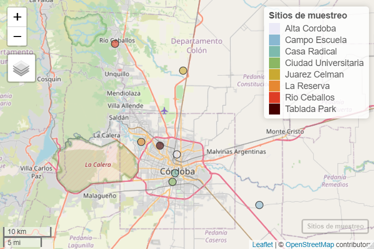
```
(ref:ubicacion) Ubicación de los sitios de muestreo.

  Descripción de cada uno de los sitios de muestreo y su uso de suelo, incorporando la interpretación de los inventarios de emisión de PM~2.5~ publicados por Enrique Pugliafito para la Argentina en 2009 [@puliafito2009gestion] y la clasificación de uso de suelo de zonas climáticas locales (LCZ) [@stewart2012local]:

  1. Ciudad Universitaria (urbano): La Facultad de Ciencias Exactas, Físicas y Naturales de la Universidad Nacional de Córdoba se encuentra ubicada en la Ciudad Universitaria, en el centro sur de la Ciudad Capital de la provincia de Córdoba, sitio que aglomera los edificios centrales de las principales universidades públicas de la provincia. La principal característica es el gran número de personas que frecuentan diariamente la zona implementando todo tipo de medios de transporte como motocicletas, automóviles y colectivos, además de otros que no generan emisiones como lo son a pie y en bicicleta. Es una zona con una gran cantidad de espacios verdes donde la cobertura del suelo es compartida por la vegetación, el pavimento y la edificación. Las principales fuentes de emisión detectadas en el sitio son el tránsito vehicular y la residencial. Dentro de la clasificación LCZ, este sitio se clasificaría como LCZ5~8~, una combinación de las categorías *open midrise* y *large low-rise*, la primera hace referencia a una disposición abierta de edificios de mediana altura (3-9 plantas), donde abunda la cubierta de suelo permeable (plantas bajas, árboles dispersos) y cuyos materiales de construcción son principalmente hormigón, acero, piedra y vidrio. Mientras que la segunda y menos importante categoría busca hacer un aporte de uso de suelo urbano con un tráfico de vehículos notable.  

  2. Casa Radical (urbano): La Casa Radical, ubicada en barrio Nueva Córdoba, en el centro de la Ciudad Capital de la provincia de Córdoba, es un edificio donde se llevan a cabo actividades políticas como reuniones y debates del partido radical. Sus alrededores se encuentran habitados por una gran cantidad de población, como consecuencia de la predominancia de edificios residenciales con numerosos pisos. Además, este sitio se encuentra frente al Boulevard San Juan, una de las calles más transitadas de la provincia, donde además de edificios residenciales se localizan numerosas empresas de servicios y locales comerciales. La vegetación que caracteriza la zona es escasa y las principales fuentes de emisión detectadas son el tráfico vehicular, la residencial y el comercio. Dentro de la clasificación LCZ, este sitio se clasificaría como LCZ2~8~, una combinación de las categorías *compact midrise* y *large low-rise*, donde la primera hace referencia a un sitio que posee una mezcla densa de edificios de mediana altura (3-9 pisos), con muy poca vegetación (pocos o ningún árbol), donde la superficie se encuentra mayoritariamente pavimentada y cuyos materiales de construcción son principalmente roca, ladrillo, teja y hormigón. Mientras que la segunda y menos importante categoría hace referencia a la disposición abierta de edificios que existe.

  3. Tablada Park (urbano): Se trata de un hogar familiar ubicado en el barrio residencial Tablada Park en la zona noroeste de la Ciudad Capital de la provincia de Córdoba. Este sitio se encuentra muy cercano a la calle Rodríguez Del Busto, que aglomera numerosos locales comerciales como supermercados y posee un alto tránsito vehicular. Los alrededores del sitio se caracterizan por ser hogares residenciales y comercios, algo muy característico de las zonas residenciales. Las principales fuentes de emisión detectadas en el sitio son el tránsito vehicular, la residencial y el comercio, además la vegetación en la zona es moderada. Dentro de la clasificación LCZ, este sitio se clasificaría como LCZ3~6~, una combinación de las categorías *compact low rise* y *open low rise*, donde la primera hace referencia a una mezcla densa de edificios de baja altura (1-3 pisos), cuya superficie se encuentra mayoritariamente pavimentada con pocos o ningún árbol y donde los principales materiales de construcción son roca, ladrillo, teja y hormigón. Mientras que la segunda categoría, hace referencia a la presencia de árboles y plantas que caracterizan la zona. 

  4. Alta Córdoba (urbano): Se trata de un hogar familiar ubicado en el barrio residencial Alta Córdoba en la zona centro norte de la Ciudad Capital de la provincia de Córdoba. Este sitio se encuentra sobre la calle Mariano Fragueiro que aglomera los principales comercios de la zona y posee un alto tránsito vehicular. Los alrededores del sitio se caracterizan por ser hogares residenciales y locales comerciales, algo característico de los sitios residenciales. Las principales fuentes de emisión detectadas en el sitio son el tránsito vehicular, la residencial, el comercio y los trenes, además la vegetación en la zona es baja. Dentro de la clasificación LCZ, este sitio se clasificaría como LCZ3, una combinación de las categorías *compact low rise* y *open low rise*, la cual hace referencia a una mezcla densa de edificios de baja altura (1-3 pisos), cuya superficie se encuentra mayoritariamente pavimentada con pocos o ningún árbol y donde los principales materiales de construcción son piedra, ladrillo, teja y hormigón.
  
  5. La Reserva (urbano): La Reserva Natural Urbana San Martín se ubica en la zona noreste de la de la Ciudad Capital de la provincia de Córdoba, al margen de la Avenida de Circunvalación de Córdoba, su actividad principal es proteger y preservar alrededor de 115 hectáreas de bosques nativos, además de concientizar acerca de la protección del medio ambiente. A pesar de ser un área verde donde predomina la cobertura de vegetación, existe una gran cantidad de barrios residenciales rodeándola, generando aportes de contaminantes provenientes del tránsito vehicular. Además, este sitio cuenta con un camping que promueve actividades regenerativas al aire libre y es frecuentado por un gran número de personas principalmente durante los fines de semana. Las principales fuentes de emisión detectadas en el sitio son el tránsito vehicular, la residencial y las cementeras. Dentro de la clasificación LCZ, este sitio se clasificaría como LCZB~A9~, una combinación de las categorías *scattered tres*, *dense trees* y *sparsely built*, donde la primera hace referencia a un sitio con un paisaje ligeramente arbolado de especímenes de hoja caduca y/o de hoja perenne, cuya cobertura del suelo es mayoritariamente permeable (plantas bajas) y su función principal es la de una zona de bosque natural, cultivo de árboles o parque urbano. Mientras que la segunda categoría busca dar información acerca de la gran densidad de árboles que existe en los alrededores y la tercer categoría busca reflejar la disposición dispersa de construcciones de pequeño y mediano tamaño.

  6. Río Ceballos (agrícola y área verde): Se trata de un hogar familiar ubicado en las afueras de la Ciudad de Río Ceballos de la provincia de Córdoba, que se caracteriza por tener un uso de suelo de área verde. Este sitio se encuentra ubicado en una zona montañosa donde predomina la cobertura de vegetación y los principales accesos son calles no pavimentadas. Es un sitio prácticamente prístino, donde las principales fuentes de PM pueden ser consideradas la re suspensión de polvo de las calles e incendios generados como consecuencia de la quema, ya sea de residuos o bien de biomasa para generar calor. La principal fuente de emisión detectada en la zona es la ganadería y el tránsito vehicular en los alrededores es notablemente reducido. Dentro de la clasificación LCZ, este sitio se clasificaría como LCZA~B9~, una combinación de las categorías *dense trees*, *scattered tres* y *sparsely built*, donde la primera hace referencia a un sitio con un paisaje muy arbolado, de especímenes de hoja caduca y/o de hoja perenne, cuya cobertura del suelo es mayoritariamente permeable (plantas bajas) y donde su función principal es de zona de bosque natural, cultivo de árboles o parque urbano. Mientras que la segunda categoría busca dar información acerca de algunas zonas poco arboladas que existen en los alrededores y la tercer categoría busca reflejar la disposición dispersa de construcciones de pequeño y mediano tamaño.
  
  7. Campo Escuela (agrícola y área verde): El Campo Escuela de la Facultad de Ciencias Agropecuarias de la Universidad Nacional de Córdoba, se encuentra ubicado camino a Capilla de los Remedios, al sur este de la de la Ciudad Capital de la provincia de Córdoba, la aglomeración poblacional más cercana es Villa Corazón de María y se caracteriza por tener un uso de suelo agrícola. En este sitio se lleva a cabo la formación práctica de los alumnos de la Facultad de Ciencias Agropecuarias, generalmente se desarrollan actividades vinculadas a la agricultura y la ganadería, la cobertura de vegetación es abundante y sus calles no se encuentran pavimentadas. Las principales fuentes emisión de PM detectadas en la zona son la agricultura y la ganadería. Dentro de la clasificación LCZ, este sitio se clasificaría como LCZD~9~, una combinación de las categorías *low plants* y *sparsely built*, donde la primera hace referencia a un sitio con un paisaje principalmente de hierbas, plantas o cultivos, con pocos árboles y cuya función principal es de pasto natural, agrícola o parque urbano. Por otra parte, la segunda categoría refleja disposición dispersa de construcciones de pequeño y mediano tamaño.

  8. Juarez Celman (agrícola y área verde): Se trata de un campo productivo ubicado en la ciudad de Juárez Celman al norte de la Ciudad Capital de la provincia de Córdoba, este se caracteriza por tener un uso de suelo agrícola. En él se desarrollan actividades productivas agropecuarias, la cobertura de vegetación es alta y sus calles no se encuentran pavimentadas. Este sitio se encuentra al margen de la Ruta Nacional 9, la cual podría generar un aporte de PM importante debido al tránsito vehicular. Las principales fuentes de PM detectadas en la zona son el tránsito vehicular, la agricultura y la ganadería. Dentro de la clasificación LCZ, este sitio se clasificaría como LCZD~9~, una combinación de las categorías *low plants* y *sparsely built*, donde la primera categoría hace referencia a un sitio con un paisaje principalmente de hierbas, plantas o cultivos, con pocos árboles y cuya función principal es de pasto natural, agrícola o parque urbano. Por otra parte, la segunda categoría refleja disposición dispersa de construcciones de pequeño y mediano tamaño.

  Las características descritas para cada uno de los sitios de muestreo determinan el uso de suelo que los representa en función de su patrón de emisión. El uso de suelo agrícola y área verde, agrupa los sitios de Campo Escuela, Juárez Celman y Río Ceballos, mientras que el uso de suelo urbano contempla los sitios de Casa Radical, Ciudad Universitaria, Tablada Park, Alta Córdoba y La Reserva.

### Base de datos

  El muestreo de PM~2.5~, se llevo a cabo entre el 30/03/2021 y el 01/06/2022, de manera simultánea en todos los sitios de muestreo. Para esto sensores de concentración de PM~2.5~ fueron dispuestos en cada uno de los sitios. Cabe destacar que los datos relevados fueron recopilados cada un intervalo de tiempo de 10 segundos, de esta forma se facilitó su limpieza y la obtención de medias horarias de mayor consistencia gracias a la reducción de la varianza generada por medio del cálculo de los promedios. A partir de estos fue que se construyó la base de datos de concentración de PM~2.5~ para el análisis. Es importante mencionar que la duración del muestreo fue específicamente de un año y tres meses, dando un total de aproximadamente 70.000 datos horarios de concentración de PM~2.5~.

### Preprocesamiento de datos

  Previo al análisis y reducción de la base de datos a medias horarias se llevó a cabo un preprocesamiento y limpieza. Este fue dividido en dos etapas, una primera en la que se estudiaron valores atípicos globales y otra en la que el estudio se centró en las distintas escalas temporales. 
  
  Una vez obtenidos los datos de contaminación de aire espaciados por un intervalo de tiempo de 10 segundos, se procedió a filtrar aquellos valores que se alejaban en más de 10 desvíos estándares de la media, y que cuyo patrón de incremento de la concentración era en forma de un salto repentino, es decir que el crecimiento de la concentración no fue paulatino y continuo en el tiempo. Siendo la media de toda la base de datos de 10.65 $\frac{\mu g}{m^3}$ y la desviación estándar de 10.67 $\frac{\mu g}{m^3}$, se procedió a eliminar aquellos valores que superaban el valor de 117.35 $\frac{\mu g}{m^3}$ describiendo un salto repentino de concentración. De esta forma se logró eliminar aquellos valores atípicos cuya concentración se veía fuertemente influenciado por eventos propios de la microescala, que no representaban la concentración para el sitio en un momento determinado. Posteriormente, se procedió a calcular las medias horarias para los distintos sitios a partir de la base de datos donde habían sido limpiados los valores atípicos globales.

  Una vez obtenida la base de datos horaria, se procedió a ajustar distintas distribuciones a la variable respuesta con el objetivo de determinar cuál era la que mejor la caracterizaba. La distribución que menores valores del criterio de información de Akaike (AIC) y del criterio de información bayesiano (BIC) entregó fue la gamma. A partir de este resultado fue que se procedió a ajustar un Modelo Lineal Generalizado Mixto que vinculaba la variable respuesta y las distintas variables indicadoras de la escala temporal (hora, día, mes, semana, estación) como factores de efectos aleatorios. Los resultados indicaron que el mayor porcentaje de variabilidad de la base de datos era explicado por las variables mes y hora. De esta forma, para cada uno de los sitios de muestreo se procedió a agrupar los datos en cada uno de los meses y las distintas horas del día, calculándose medidas resumen estadísticas para cada una de las combinaciones. Posteriormente, se filtraron aquellos valores que, para un determinado sitio de muestreo, en un mes particular y a una hora determinada se alejaba en más de 10 desvíos estándares de la media de cada caso particular. 
  
  De esta forma fue como se llevo a cabo una depuración de la base de datos de los valores atípicos globales, seguida por otra depuración en el contexto temporal, con el objetivo de identificar aquellos valores que se encontraban influenciados por efectos aislados de la microescala y que atentaban contra el patrón general de los datos. 
  
### Análisis estadístico

  En primera instancia se buscó explorar gráficamente la variabilidad temporal existente en la concentración media horaria de PM~2.5~ en las distintas escalas temporales, para así poder identificar las tendencias, ciclos y patrones que influyen esta serie de tiempo.
  
  En segundo lugar se llevo a cabo un análisis de la concentración de PM~2.5~ en cada uno de los sitios de muestreo, con el objetivo de demostrar la influencia de las condiciones propias del sitio en la concentración del contaminante.

  Luego se exploró la variabilidad temporal de la serie en cada uno de los usos de suelo, con el objetivo de verificar si las tendencias respecto del análisis promedio realizado en primera instancia se encontraba presente en cada uno de los usos especificados. 
  
  Ademas, este análisis se complemento con uno netamente descriptivo y comparativo entre las series temporales para cada uno de los usos de suelo. Involucrando el cálculo de medidas de resumen y la comparación gráfica. 

### Resultados y Discución

#### Filtrado *outliers* globales.

  En esta etapa de preprocesamiento se excluyeron las observaciones de PM~2.5~ que se encontraban alejados de la media por más de 10 desvíos estándares. De esta forma se filtraron un total de 5 datos cuyos valores de PM~2.5~ se correspondían con eventos anómalos sucedidos en los sitios durante el muestreo, como por ejemplo, incendios cercanos o caídas del sensor. Estos valores resultaban notablemente superiores al resto de los datos, interpretándose como una fuente de ruido para el análisis. 

#### Filtrado *outliers* temporales.

  En primer lugar, se determinó cuál era la distribución que mejor ajustaba a la variable respuesta. Los resultados evidenciaron que la distribución gamma logro minimizar los criterios de AIC y BIC. Una vez establecida la distribución se procedió a ajustar un Modelo Lineal Generalizado Mixto, con el objetivo de determinar cuáles variables temporales explicaban mayor porcentaje de varianza.

Table: Variabilidad explicada por las componentes temporales de la base de datos.\label{tab:comptemp}
Componente temporal; varianza estimada; desviación estándar estimado; porcentaje de varianza explicado relativo al total.

| Componente |Varianza |Desviación estándar|Porcentaje de varianza|
|------------|:--------------:|:--------------:|:--------------:|
| Hora | 0.070 | 0.265 |  4.975 |
| Mes | 0.172 | 0.414 | 12.184 |
| Día | 0.011 | 0.106 |  0.797 |
| Semana | 0.001 | 0.026 |  0.049 |
| Estación | 0.033 | 0.173 |  2.083 |
| Residual | 1.155 | 1.075 | 79.912 |

  A partir de la tabla \@ref(tab:comptemp), puede apreciarse que las variables temporales que mayor porcentaje de variabilidad explican son en primer lugar los meses del año, seguido por las horas del día.
  
  Una vez obtenidos estos resultados, se procedió a filtrar aquellas observaciones que, para un mismo sitio, mes del año y hora del día, se encontraban a más de cinco desvíos estándares de su respectiva media. El filtro aplicado removió en total 273 valores, que representan el 0.455% de la base de datos, dado que, serían problemáticos tanto en el análisis exploratorio, como también en la etapa de modelado predictivo.

#### Análisis horario

```{r pmhorariolinea, echo=FALSE, out.width="100%", fig.align="center", fig.cap="(ref:pmhorariolinea)"}
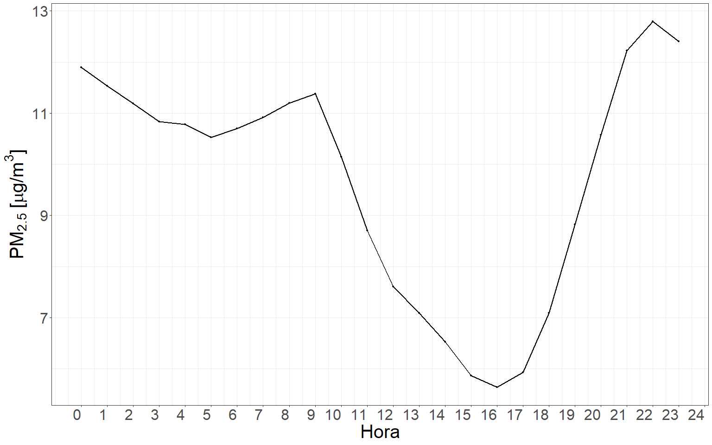
```
(ref:pmhorariolinea) Perfil de concentración promedio horario de PM~2.5~ a lo largo de las horas del día.

  La figura \@ref(fig:pmhorariolinea) ilustra el patrón de variabilidad de la concentración promedio horaria de PM~2.5~ a lo largo de las horas del día. Este se caracteriza por mostrar un bache mínimo de concentración entre las 15 y 17 horas, encerrado por dos picos que ocurren por la mañana entre las 7 y 9 horas y por la noche entre las 21 y 23 horas. Este patrón de concentración horaria puede estar influenciado por diversos factores, como los patrones de emisión de las fuentes de contaminación, la estabilidad de la atmósfera, los patrones de tráfico vehicular de la población, entre otros. Es importante destacar que la figura muestra una visión general de la variabilidad temporal, pero no permite identificar la influencia de variables temporales específicas como días de la semana, meses del año o condiciones meteorológicas.
  
#### Análisis diario

```{r pmdialineageneral, echo=F, out.width="100%", fig.align='center', fig.cap="(ref:pmdialineageneral)"}
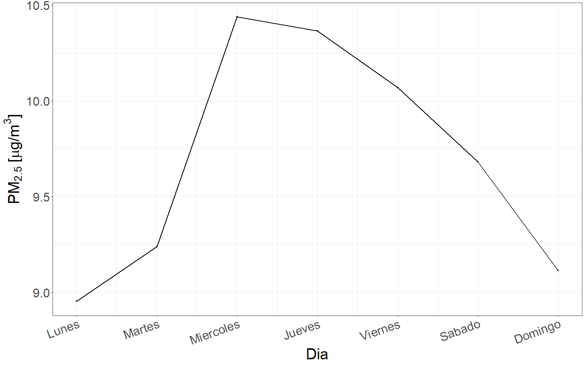
```
(ref:pmdialineageneral) Perfil de concentración promedio diario de PM~2.5~ a lo largo de los días de la semana.

  En la figura \@ref(fig:pmdialineageneral) puede apreciarse el patrón de variabilidad de la concentración promedio diaria de PM~2.5~ a lo largo de los días de la semana. La tendencia observada es un aumento en las concentraciones de PM~2.5~ a medida que nos adentramos en la semana, con un pico máximo de concentración los días miércoles y jueves. En contraste, los días domingo se registran las concentraciones más bajas de PM~2.5~, y a partir de ese día, estas aumentan gradualmente hasta alcanzar su punto máximo durante la mitad de la semana laboral. A partir de ese punto, se observa un descenso gradual en las concentraciones hasta llegar al fin de semana. Esta tendencia semanal puede ser influenciada por diversos factores como la actividad humana, el clima, los patrones de viento y la actividad industrial.

```{r pmdialinea, echo=F, out.width="100%", fig.align='center', fig.cap="(ref:pmdialinea)"}
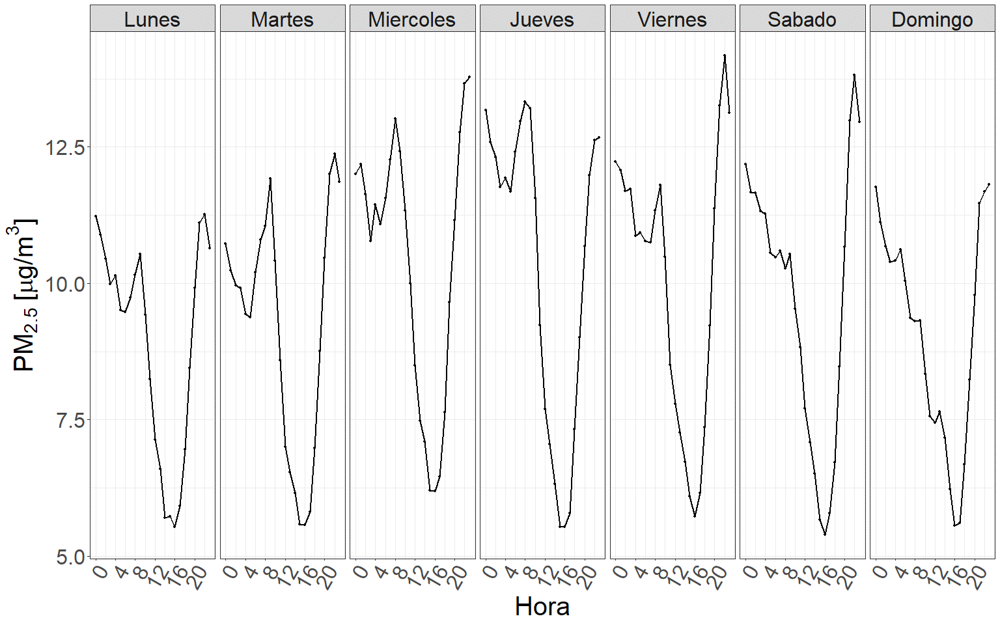
```
(ref:pmdialinea) Perfil de concentración promedio horario de PM~2.5~ en cada día de la semana a lo largo de la semana.

  En la figura \@ref(fig:pmdialinea) puede apreciarse el patrón de variabilidad de la concentración de PM a lo largo de las horas del día en los distintos días de la semana. Puede observarse una clara estructura de dependencia, demostrando que las concentraciones de PM en una hora determinada son similares a lo largo de los distintos días de la semana. Además, las concentraciones guardan un mayor parentesco en su magnitud mientras más próximos entre sí se encuentren los días de la semana. Esta estructura de dependencia a lo largo de los días de la semana es importante a la hora de comprender la dinámica de variación de la concentración de PM.

#### Análisis mensual

```{r pmmeslineageneral, echo=F, out.width="100%", fig.align='center', fig.cap="(ref:pmmeslineageneral)"}
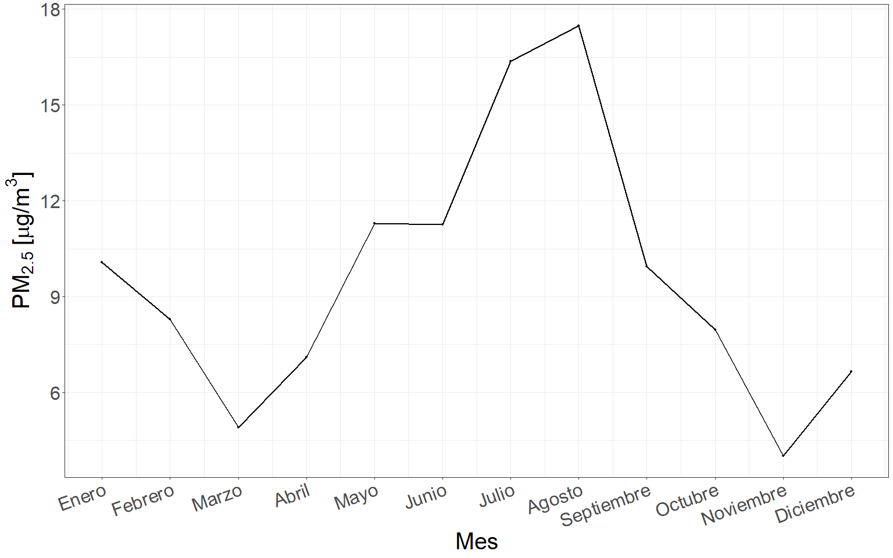
```
(ref:pmmeslineageneral) Perfil de concentración promedio mensual de PM~2.5~ a lo largo del año.

  A partir de la figura \@ref(fig:pmmeslineageneral), se aprecian las concentraciones de PM~2.5~ promedio mensuales registradas a lo largo de los distintos meses del año. Puede notarse que las mayores concentraciones fueron registradas durante los meses de mayo, junio, julio y agosto, mientras que en los meses de noviembre, marzo y diciembre se registraron las menores concentraciones. 

```{r pmmeslinea, echo=F, out.width="100%", fig.align='center',  fig.cap="(ref:pmmeslinea)"}
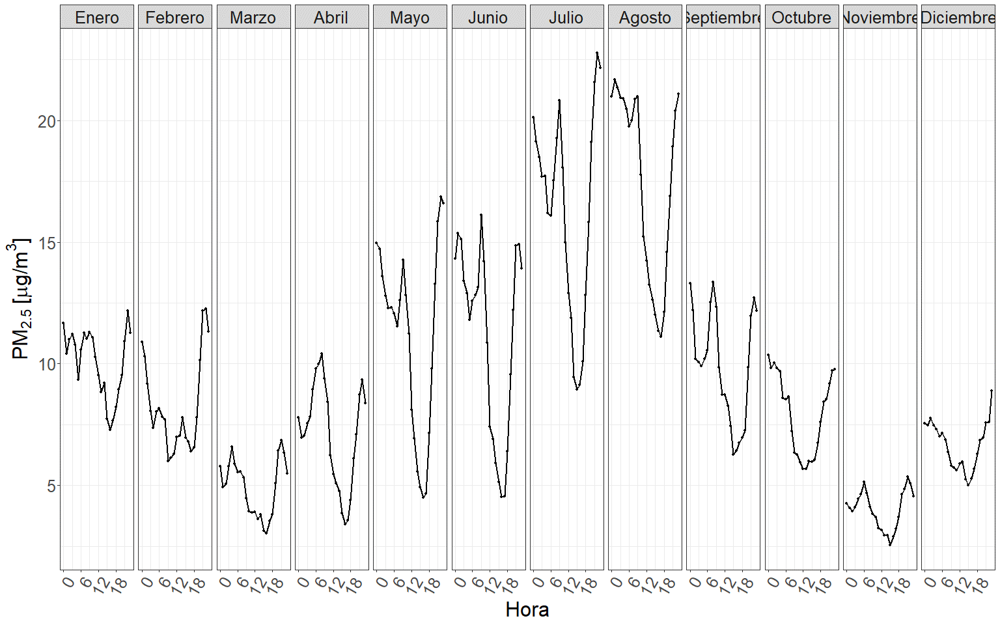
```
(ref:pmmeslinea) Perfil de concentración promedio horario de PM~2.5~ para cada mes a lo largo del año.

  En la figura \@ref(fig:pmmeslinea) se destaca el patrón de variabilidad en la concentración del PM a lo largo de las horas del día en los distintos meses del año, el cual refleja otra estructura de dependencia temporal de la variable respuesta. Es decir, que las mismas horas del día son propensas a tener concentraciones similares de PM~2.5~ a lo largo de los distintos meses del año y esta concentración guarda un mayor parentesco en su magnitud mientras más cercanos se encuentren los meses a lo largo del año. 

#### Análisis estacional

```{r pmest, echo=F, out.width="100%", fig.align='center', fig.cap="(ref:pmest)"}
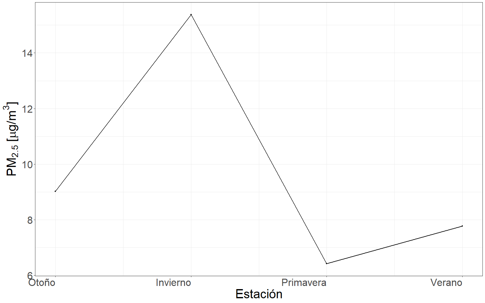
```
(ref:pmest) Perfil de concentración promedio por estación de PM~2.5~ a lo largo del año.

  La figura \@ref(fig:pmest) muestra el patrón de variabilidad en la concentración de PM~2.5~ promedio a lo largo de las diferentes estaciones del año. Puede notarse que las mayores concentraciones se registraron en las estaciones de otoño e invierno, siendo aún más altas en invierno. Por otro lado, las menores concentraciones se registraron durante la primavera y el verano. Estos resultados indican una clara dependencia de la concentración de PM~2.5~ con la estación del año.

```{r pmestacionhora, echo=F, out.width="100%", fig.align='center',  fig.cap="(ref:pmestacionhora)"}
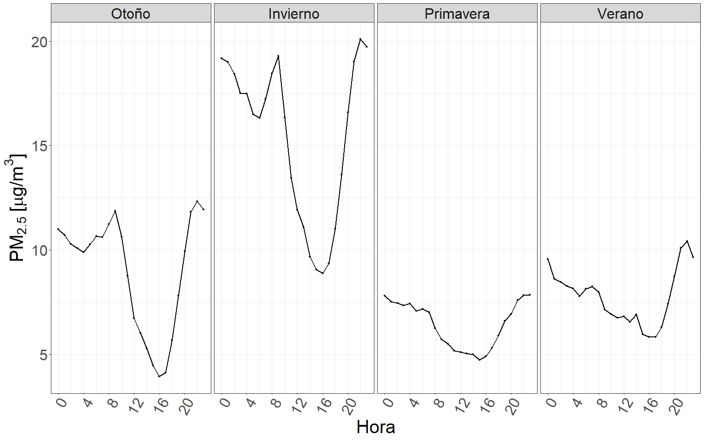
```
(ref:pmestacionhora) Perfil de concentración promedio horario de PM~2.5~ para cada estación a lo largo del año.

  La figura \@ref(fig:pmestacionhora) destaca el patrón de variabilidad de la concentración del PM a lo largo de las horas del día en las distintas estaciones del año, reflejando una estructura de dependencia temporal de la variable respuesta. Puede notarse que la concentración de PM~2.5~ varia en magnitud según la estación del año, siendo más elevadas en invierno y otoño, mientras que en primavera y verano las concentraciones son menores. Además, se evidencia que, dentro de cada estación, las concentraciones de PM~2.5~ presentan un patrón similar a lo largo de las distintas horas del día. Esto sugiere una estructura de dependencia entre la concentración horaria de PM~2.5~ y la estación del año.

  Las características temporales descritas en la serie de tiempo, demuestran la existencia de ciclos y patrones repetitivos en su perfil de variación. Además, los resultados indican que la variación de las condiciones meteorológicas a lo largo de los meses y estaciones del año influye notablemente en la concentración de PM~2.5~. Las condiciones meteorológicas características entre los meses de mayo a agosto favorecen condiciones adversas de calidad de aire, mientras que el resto del año estas se ven atenuadas (inversiones térmicas características del invierno).

#### Descripción de la concentración promedio anual de PM~2.5~

Table: Concentración anual promedio de PM~2.5~ en los sitios de muestreo dentro del área metropolitana de la provincia de Córdoba.\label{tab:concgral}
Los valores se encuentran en $\frac{\mu g}{m^3}$.

| Medida descriptiva | Concentración |
|--------------------|:-------------:|
| Media | 10.65 |
| Desviación estándar | 10.67 |
| Máximo | 150 |
| Mínimo | 0 |
| Muestras | 69587 |

  A lo largo de todo el período de muestreo, se obtuvo una concentración promedio de PM~2.5~ de 10.65 $\frac{\mu g}{m^3}$ considerando todos los sitios de muestreo. Sin embargo, los valores oscilaron entre 0 y 150 $\frac{\mu g}{m^3}$, indicando una amplia variabilidad en la concentración de PM~2.5~ en los diferentes sitios de muestreo (Tabla \@ref(tab:concgral)).

#### Descripción de la concentración promedio de PM~2.5~ en cada uno de los sitios de muestreo

Table: Concentración promedio anual de PM~2.5~ en cada sitio de muestreo.\label{tab:concanual}
Sitio de muestreo; concentración promedio anual de PM~2.5~; desviación estándar.

| Sitio | Concentración| Desviación estándar | 
|--------|:--------:|:--------:|
| Tablada Park | 13.89 | ±12.7  |
| Casa Radical | 12.1 | ±10.2 |
| Ciudad Universitaria | 11.5 | ±10.7 |
| La Reserva | 10.3 | ±10.2 |
| Alta Córdoba | 9.08 | ±8.60 |
| Campo Escuela | 8.88 | ±9.22  |
| Río Ceballos | 6.40 | ±6.36 |
| Juarez Celman | 6.00 | ±6.88 |
  
  Las concentraciones anuales de PM~2.5~ promedio en los distintos sitios de muestreo (Tabla \@ref(tab:concanual))) muestran una variabilidad considerable. Esta variabilidad evidencia diferencias y similitudes entre los mismos, sugiriendo que la clasificación implementada para definir los sitios de muestreo no necesariamente refleja el patrón de emisión de PM~2.5~ en cada uno de ellos.

Table: Concentración promedio estacional de PM~2.5~ en cada sitio de muestreo.\label{tab:concestsit}
Sitio de muestreo; concentración promedio estacional de PM~~2.5~~; desviación estándar. 

| Sitio | Invierno | Otoño | Primavera | Verano | 
|--------|:--------:|:--------:|:--------:|:--------:|
| Tablada Park | 17.6±14.3 | 14.4±13.7 | 6.80±5.91 | 6.30±4.25 |
| Casa Radical | 19.8±12.9 | 11.7±9.52 | 7.85±5.85 | 9.53±7.40 |
| Ciudad Universitaria | 17.6±13.6 | 10.9±10.3 | 7.64±6.69 | 9.92±8.34 |
| La Reserva | 20.0±14.3 | 10.2± 9.42 | 5.79±4.87 | 7.69±6.35 |
| Alta Córdoba | 15.1±12.7 | 10.7±9.79 | 6.00±3.73 | 6.72±5.83 |
| Campo Escuela | 12.4±11.4 | 6.54±6.99 | 6.36±5.29 | 6.21±5.12 |
| Río Ceballos | 9.65±7.96 | 4.78±4.69 | 5.20±5.28 | 6.59±6.34 |
| Juarez Celman | 11.3±9.79 | 4.71±4.43 | 4.30±6.38 | 4.30±4.54 |

  A partir de la tabla \@ref(tab:concestsit), pueden identificarse estaciones en las que las condiciones atmosféricas favorecen condiciones adversas de calidad de aire. Las condiciones meteorológicas características de las mismas influencian el aumento de la concentración del contaminante o bien impiden su dispersión. Puede apreciarse que las concentraciones de este contaminante son más elevadas durante el otoño y el invierno en comparación con el resto del año. Además, pueden notarse patrones consistentes de concentración entre los sitios en las distintas estaciones, sugiriendo que la variación de las condiciones meteorológicas influye en la concentración de PM~2.5~. Específicamente, se observan concentraciones máximas durante los meses de mayo, junio, julio y agosto, y concentraciones mínimas durante los meses de enero, febrero y diciembre (Tabla \@ref(fig:pmmeslineageneral)).
  
  Además, se destaca que los mayores desvíos estándares ocurren durante el invierno, demostrando ser la estación del año con características más inestables de concentración de PM~2.5~. Esto sugiere que factores locales, como la densidad de tráfico, la cercanía a fuentes de emisiones y la quema de biomasa para calefacción, podrían estar influyendo de manera significativa la concentración de este contaminante en la ciudad (Tabla \@ref(tab:concestsit)).

#### Análisis horario por uso de suelo
  
```{r pmhoruso, echo=FALSE, out.width="100%", fig.align="center",fig.cap="(ref:pmhoruso)"}
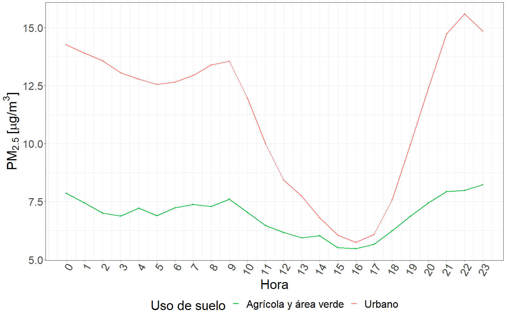
```
(ref:pmhoruso) Perfil de concentración promedio horario de PM~2.5~ a lo largo de las horas del día, discriminado por uso de suelo.

  La figura \@ref(fig:pmhoruso) permite observar el patrón de variabilidad de la concentración promedio horaria de PM~2.5~ a lo largo de las horas del día, discriminado por los distintos usos de suelo identificados mediante el análisis de clúster. Como puede apreciarse, el patrón de variabilidad en la concentración de PM~2.5~ a lo largo del día es evidente en los sitios con uso de suelo urbano, aunque se presenta en menor medida en el uso de suelo agrícola y área verde, en donde las características, fuentes de emisión, actividades desarrolladas y ubicación geográfica generan que el perfil se vea atenuado.

  En el caso de los sitios con uso de suelo urbano, la concentración promedio horaria de PM~2.5~ presenta un patrón de aumento en la mañana, disminuyendo notablemente por la tarde, para aumentar nuevamente hacia la noche. Por otro lado, en el caso de los sitios con uso de suelo agrícola y área verde, el patrón de variabilidad en la concentración de PM~2.5~ a lo largo del día se encuentra presente, aunque es menos evidente. En resumen, la figura \@ref(fig:pmhoruso) confirma la presencia del patrón de variabilidad de la concentración promedio horaria de PM~2.5~ en los distintos usos de suelo.

#### Análisis diario por uso de suelo

```{r pmdiausolinea, echo=FALSE, out.width="100%", fig.align="center",fig.cap="(ref:pmdiausolinea)"}
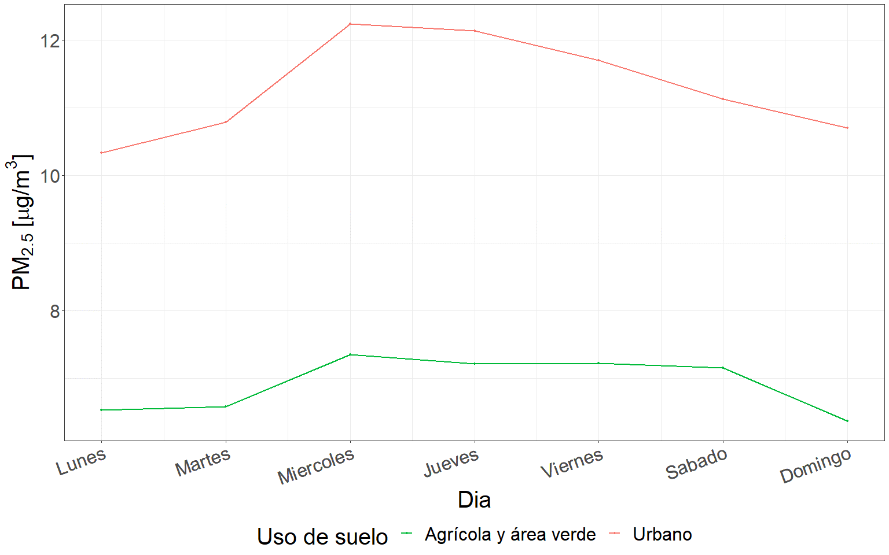
```
(ref:pmdiausolinea) Perfil de concentración promedio diario de PM~2.5~ a lo largo de los días de la semana, discriminado por uso de suelo.

  Además, en la figura \@ref(fig:pmdiausolinea) puede apreciarse que para el uso de suelo urbano, las concentraciones de PM~2.5~ son mayores durante los días hábiles de la semana, mientras que disminuyen en los días de fin de semana, sugiriendo una relación con las actividades laborales y de tráfico vehicular asociadas a estos usos de suelo. Sin embargo, para el uso de suelo agrícola y área verde no logra observase esta variación entre días hábiles y de fin de semana, lo que podría encontrarse vinculado a la variación en las actividades laborales y la notable reducción del tráfico vehicular en estas áreas.

```{r pmdiahorusolinea, echo=FALSE, out.width="100%", fig.align="center",fig.cap="(ref:pmdiahorusolinea)"}
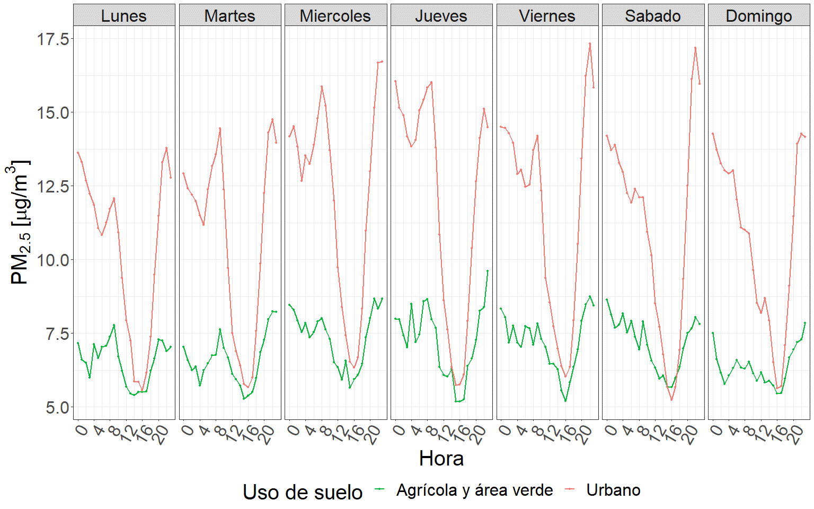
```
(ref:pmdiahorusolinea) Perfil de concentración promedio horario de PM~2.5~ en la horas del día a lo largo de los días de la semana, discriminado por uso de suelo.

   A partir de la figura \@ref(fig:pmdiahorusolinea), puede apreciarse que la concentración de PM~2.5~ sigue un patrón de variabilidad similar a lo largo de los días de la semana, independientemente del uso del suelo, a pesar de que existan diferencias en magnitud. La dinámica de movilidad de la población es un factor determinante para este contaminante, siendo el tráfico de vehículos motorizados una de las fuentes que mayor influencia genera en la variabilidad del PM [@pant2013estimation; @weerakkody2018quantification].

  En el caso del uso de suelo urbano, la diferencia en la concentración de PM~2.5~ podría estar relacionada con la densidad de personas y vehículos que frecuentan estos sitios durante los días laborables, la cual es notablemente superior a la que lo hace durante los fines de semana. De esta forma se genera una mayor concentración de partículas durante los días laborables y una disminución durante los fines de semana. En consecuencia, puede apreciarse que la concentración de PM~2.5~ aumenta hasta alcanzar un pico los días miércoles o jueves, mientras que la mínima se observa durante los fines de semana, generalmente los días domingo o lunes (Figura \@ref(fig:pmdiausolinea)).
  
  En contraste, en los sitios cuyo uso de suelo es agrícola y área verde, el patrón de variabilidad no es tan evidente debido a que las principales fuentes de emisión no se relacionan directamente con la densidad poblacional. Por lo tanto, la concentración de PM~2.5~ en estos sitios alcanza su máximo entre los días miércoles a sábados y llega a su mínimo los días domingo o lunes, sin observarse un pico pronunciado durante los días laborables.

#### Análisis mensual por uso de suelo

```{r pmmesuso, echo=FALSE, out.width="100%", fig.align="center",fig.cap="(ref:pmmesuso)"}
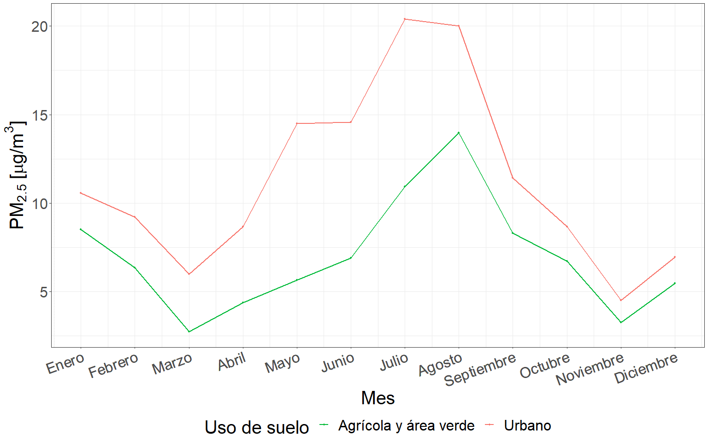
```
(ref:pmmesuso) Perfil de concentración promedio mensual de PM~2.5~ a lo largo de los meses del año, discriminado por uso de suelo.

  En la figura \@ref(fig:pmmesuso), puede destacarse la presencia de un ciclo mensual en la concentración del PM~2.5~ para los distintos usos de suelo a lo largo del año. Es evidente que los registros indican concentraciones máximas durante los meses de julio y agosto, mientras que mínimas durante los meses de marzo, abril y noviembre. A pesar de que los ciclos varían en magnitud en los distintos usos de suelo, estos se encuentran presentes en todos ellos. De esta forma podría establecerse que la variabilidad de las condiciones meteorológicas a lo largo de los meses logra explicar gran parte de la variabilidad de la concentración del PM, independientemente del uso de suelo considerado. 

#### Análisis estacional por uso de suelo

```{r pmestacionuso, echo=FALSE, out.width="100%", fig.align="center",fig.cap="(ref:pmestacionuso)"}
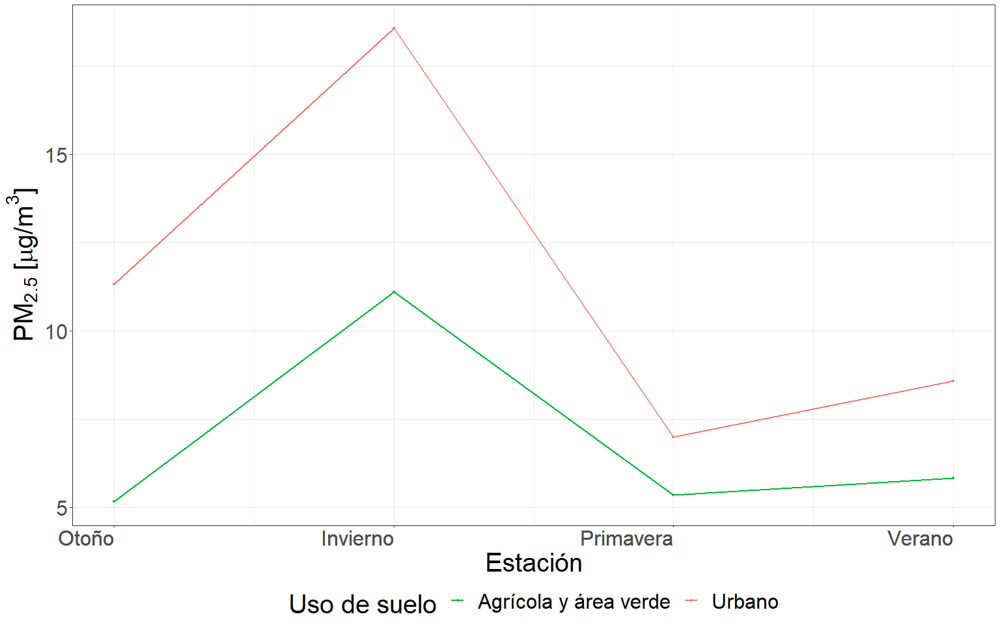
```
(ref:pmestacionuso) Perfil de concentración promedio estacional de PM~2.5~ a lo largo del año, discriminado por uso de suelo.

  En la figura \@ref(fig:pmestacionuso), puede apreciarse que el patrón estacional de concentración de PM~2.5~, previamente observado en la figura \@ref(fig:pmest), se mantiene constante en los distintos usos de suelo, a pesar de variar magnitud entre ellos. De esta forma, puede notarse que, al igual que en el análisis general, se registran menores concentraciones en el sitio con uso de suelo agrícola y área verde. Esto sugiere que la estacionalidad en la concentración del PM se encuentra altamente influenciada por factores climáticos y meteorológicos que actúan de manera similar en los distintos tipos de uso de suelo. Además, los resultados resaltan la importancia de considerar las características específicas del sitio de estudio al momento de evaluar los niveles de contaminación atmosférica, y cómo estos pueden variar en función de factores ambientales y de uso del suelo.
  
```{r pmestacionhorauso, echo=FALSE, out.width="100%", fig.align="center",fig.cap="(ref:pmestacionhorauso)"}
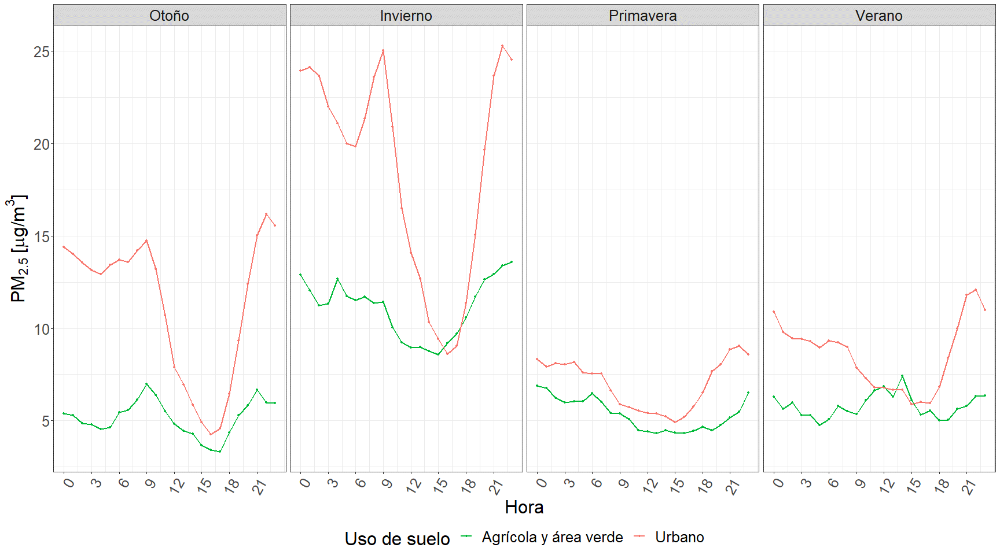
```
(ref:pmestacionhorauso) Perfil de concentración promedio horario de PM~2.5~ a lo largo de las horas del día en las distintas estaciones del año, discriminado por uso de suelo.

  En la figura \@ref(fig:pmestacionhorauso) puede observarse el patrón de variabilidad de la concentración promedio horaria de PM~2.5~ a lo largo de las horas del día en las distintas estaciones discriminado en los usos de suelo obtenidos a partir del análisis de clúster realizado. Es interesante destacar que el patrón de variabilidad de la concentración que se observa para el análisis general (figura \@ref(fig:pmest)) se mantiene constante en los distintos usos de suelo, aunque disminuye en magnitud para el uso de suelo agrícola y área verde.
  
  Esto sugiere que las condiciones meteorológicas durante la época fría favorecen condiciones adversas de calidad del aire, independientemente del uso de suelo. Además, es importante mencionar que la concentración promedio horaria de PM~2.5~ en los distintos usos de suelo presenta una tendencia a aumentar durante las horas de la mañana, disminuir en la tarde y aumentar nuevamente durante las horas de la noche. Tendencias que podrían encontrarse vinculadas a los patrones de movilidad y actividad de la población, así como a las variaciones en las emisiones de contaminantes durante el día.

#### Análisis descriptivo de las series temporales de concentración de PM~2.5~ para cada uno de los usos de suelo

Table: Medidas descriptivas para comparar las series temporales promedio para los distintos usos de suelo. \label{tab:descript}
Referencias: coeficiente de variación (CV) y rango intercuartílico (RI).

| Medida | Urbano | Agrícola y área verde |
|:-----------------------------:|:---------:|:---------:|
| Media | 11.54 | 6.78 |
| Varianza | 97.91 | 37.23 |
| Desvió estándar  | 9.90 | 6.10 |
| CV  | 0.86 | 0.90 |
| Máximo | 81.80 | 47.02 |
| Mínimo | 0 | 0 |
| Rango | 81.79 | 47.02 |
| Percentil 50  | 8.41 | 4.92 |
| Percentil 75  | 15.72 | 9.30 |
| Percentil 90  | 25.49 | 15.16 |
| Percentil 95  | 32.11 | 19.57 |
| RI | 7.31 | 4.38 |

  A partir de los datos de la tabla \@ref(tab:descript) puede apreciarse que la media para la serie de datos urbanos es notablemente superior que para la serie agrícola y área verde. Este hecho podría llevarnos a interpretar que a primera vista la concentración de PM~2.5~ es superior en entornos urbanos. Sin embargo, es importante destacar que esta medida de posición puede verse fuertemente influenciada por valores extremos, lo que reduce su representatividad.
  
  Por lo tanto, para realizar una comparación más precisa, es más adecuado emplear la mediana. Puede apreciarse que la serie proveniente de entornos urbanos posee un percentil 50 de 8.41 $\frac{\mu g}{m^3}$, indicando que la mitad de los datos toman un valor igual o menor a este. Por otra parte, la mediana para la serie agrícola y área verde es de 4.92 $\frac{\mu g}{m^3}$, dando un indicio de que las series de datos provenientes de entornos urbanos muestran mayores concentraciones que la proveniente de entornos agrícolas y áreas verdes.

  También puede apreciarse que el valor del percentil 90 para la serie de datos agrícola y de área verde es prácticamente similar al percentil 75 de la serie de datos urbana. Este hecho evidencia en términos generales que un mayor porcentaje de datos se encuentra por debajo del mismo límite numérico, de esta forma indicando que la serie de datos urbana toma valores de mayor magnitud que la serie de datos agrícola y área verde.  
  
 En cuanto a las medidas de dispersión, como la varianza y la desviación estándar, puede notarse que las mayores magnitudes se observan en la serie de datos urbana indicando una mayor dispersión y por lo tanto, un mayor alejamiento de los registros respecto de su media. Mientras que los valores más bajos se observan en la serie agrícola y de áreas verdes, evidenciando una mayor concentración de datos respecto de su media. Esto significa que los valores que toma la variable son más homogéneos y están menos dispersos con respecto a su media.

  Además, el coeficiente de variación permite concluir que la serie de tiempo agrícola y área verde posee menor dispersión de datos respecto a su media o lo que es equivalente, mayor concentración de datos en torno a su media respecto de la serie urbana.
  
  De esta forma queda en evidencia que la serie de tiempo urbana toma valores de mayores magnitudes que la serie de tiempo agrícola y área verde, encontrándose sus registros más dispersos respecto a su media. A su vez, la serie de tiempo agrícola y área verde posee una menor dispersión o mayor concentración de registros respecto de su media.
  
  Asimismo, es importante destacar que estos resultados son específicos para la zona y el período de estudio, y que podrían variar en otras regiones geográficas y períodos de tiempo. Por tanto, se sugiere continuar con investigaciones adicionales para determinar la variabilidad y patrones de distribución del PM~2.5~ en distintas zonas y períodos de tiempo. Además, se recomienda que los resultados obtenidos en esta investigación sean considerados para el diseño de políticas y estrategias de gestión ambiental en la zona de estudio, con el fin de reducir la exposición de la población a este contaminante y promover la protección de la salud pública y el medio ambiente.

```{r boxplotcomp, echo=FALSE, out.width="100%", fig.align="center", fig.cap="(ref:boxplotcomp)"}
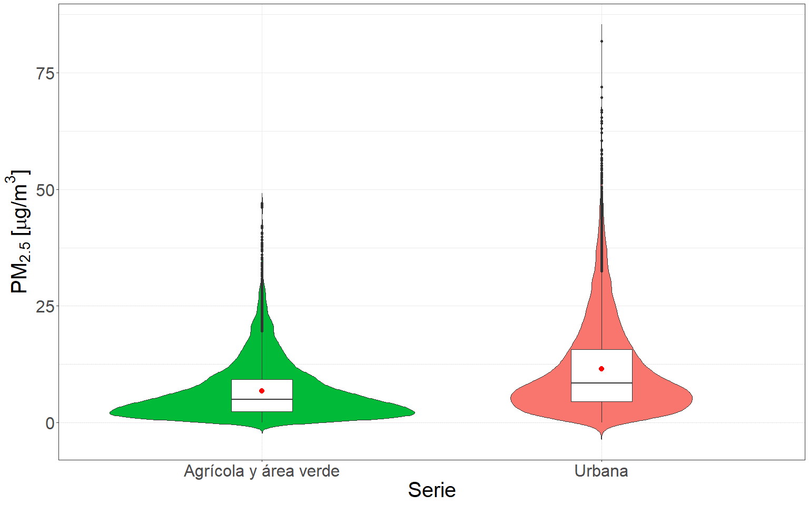
```
(ref:boxplotcomp) Diagrama de caja que compara la concentración promedio horaria de PM~2.5~ en la series con distintos usos de suelo. La media de las serie se encuentra indicada por el punto rojo dentro de la caja.

  A partir de la figura \@ref(fig:boxplotcomp) se puede notar en primer lugar una diferencia en el tamaño de la caja para los distintos usos de suelo, esta diferencia es representativa de la mayor dispersión observada para la serie urbana y la mayor concentración de datos en torno a su media para la serie agrícola y área verde. Además, puede apreciarse la influencia de valores extremos en todas las series generando un corrimiento de la media respecto de la mediana, este corrimiento es superior para la serie de datos urbana, indicando un mayor porcentaje de valores extremos y, por lo tanto, una mayor influencia en esta medida de resumen.

  Es importante destacar que la forma de la caja y la posición de la media y la mediana indican una distribución del tipo asimétrica positiva o bien sesgada derecha para todas las series, demostrando una mayor concentración de datos en bajos valores de la variable respuesta. Además, puede apreciarse que para la serie de datos agrícola y área verde, la densidad de datos en la parte, inferior es superior que para el resto de los usos de suelo. Por otra parte la serie de datos urbana muestra una menor densidad de datos en su parte inferior, confirmando que en los entornos urbanos la concentración de PM~2.5~ toma valores de mayores magnitudes, además de tener una mayor dispersión con respecto a su media. 
  
  En resumen, los resultados obtenidos a partir del análisis de la figura \@ref(fig:boxplotcomp) indican una clara diferenciación en cuanto a la dispersión y concentración de los datos para los distintos usos de suelo, de esta formando confirmando los resultados obtenidos por el análisis de clústeres.

```{r seriescomp, echo=FALSE, out.width="100%", fig.align="center", fig.cap="(ref:seriescomp)"}
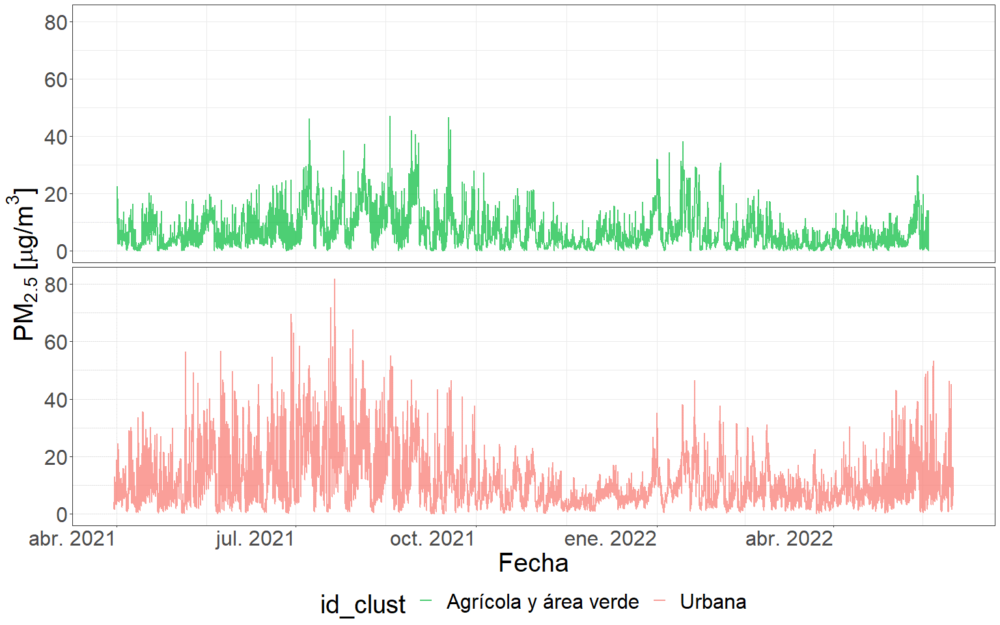
```
(ref:seriescomp) Serie de tiempo de la concentración promedio horaria de PM~2.5~ en entornos de distinto uso de suelo.

  A partir de la figura \@ref(fig:seriescomp) puede notarse que se trata de series temporales que logran diferenciarse en función de sus comportamientos a lo largo del tiempo. Es importante destacar que la serie agrícola y de área verde muestra un rango de variación significativamente inferior en comparación con las otras series. Esto refuerza la idea de que los datos la misma se encuentran mayormente concentrados alrededor de su media y que la dispersión en torno a ella es menor. Además, puede observase que los valores de la serie urbana oscilan en un rango de magnitud mucho mayor en comparación con la serie agrícola y de área verde.

  En primer lugar, la serie de datos agrícola y área verde demuestra un rango de variación notablemente inferior respecto de la serie urbana, esto confirma la mayor concentración de datos respecto a su media y la mayor compresión o dispersión en torno a la misma. Además, puede apreciarse que los valores entre los que fluctúan la serie urbana son notablemente superiores a los valores entre los cuales lo hace la serie agrícola y área verde. De esta forma la serie de datos urbana demuestra ser más inestable, pasando desde picos de elevada magnitud a baches mínimos de forma sucesiva y repetitiva a lo largo del tiempo.
  
  Por otro lado, la serie urbana demuestra una mayor inestabilidad, con una sucesión repetitiva de picos de elevada magnitud y baches mínimos a lo largo del tiempo. Estos resultados confirman que esta serie es la que presenta valores de mayor magnitud, dispersión respecto a su media e inestabilidad, dado a las repetitivas fluctuaciones en la magnitud de sus valores a lo largo del tiempo. 
  
  En contraste, la serie de datos agrícola y área verde es notablemente más estable en términos de la magnitud de los valores que toma, con una menor fluctuación entre ellos. Esto sugiere que los datos de esta serie se encuentran más concentrados respecto de su media y que poseen una menor dispersión en comparación con el otro uso de suelo.
  
## Conclusión
  
  La distribución teórica que minimizo los valores del criterio de información de Akaike (AIC) y del criterio de información bayesiano (BIC), demostrando el mejor ajuste a los datos de concentración PM~2.5~ fue la distribución gamma. 
  
  Las características temporales de la serie de concentración de PM~2.5~ permiten explicar gran parte de la variabilidad de la misma. A su vez las características espaciales, referidas a la ubicación y la influencia diferencial de la micro escala en cada uno de los usos de suelo, permite explicar la diferencia en la magnitud de concentraciones existente en cada uno de ellos.
  
  Las características temporales de la serie promedio de concentración de PM~2.5~ se mantienen constantes independientemente del uso de suelo del que se trate, reflejando el mismo patrón de variación a lo largo de las distintas escalas temporales. A pesar de mostrar un patrón de variación similar, puede destacarse que el mismo se ve atenuado en cuanto a la magnitud de las concentraciones en la serie agrícola y área verde en comparación con la serie urbana. Este hecho refleja que el patrón de variación de la concentración de PM~2.5~ responde a una dinámica temporal similar, que se encuentra fuertemente influenciada por las condiciones espaciales de los sitios que se estén analizando, lo cual se ve reflejado en la variación de las magnitudes entre los usos de suelo.  
  
  El análisis exploratorio confirmó la diferencia existente entre las series temporales provenientes de distintos usos de suelo. La serie de datos proveniente de entornos agrícolas y área verde demostró ser una de concentraciones de menor magnitud, mayormente concentradas en función de su media, demostrando pocas fluctuaciones entre valores de elevada y baja magnitud, caracterizándose por ser una serie temporal de menor variabilidad en comparación con la urbana. Por su parte, la serie de datos proveniente de entornos urbanos, demostró ser una que toma valores de mayor magnitud, más dispersa respecto de su media, demostrando gran cantidad de fluctuaciones entre valores de baja y elevada magnitud, es decir de mayor variabilidad. 
  
  Finalmente, junto con la variación de las escalas temporales de mayor magnitud, como los meses y estaciones, se identificó la variación de las condiciones meteorológicas a lo largo de los mismos. Esta variación demostró potencial para explicar la variabilidad de la concentración de PM~2.5~, independientemente del uso de suelo que se esté considerando.