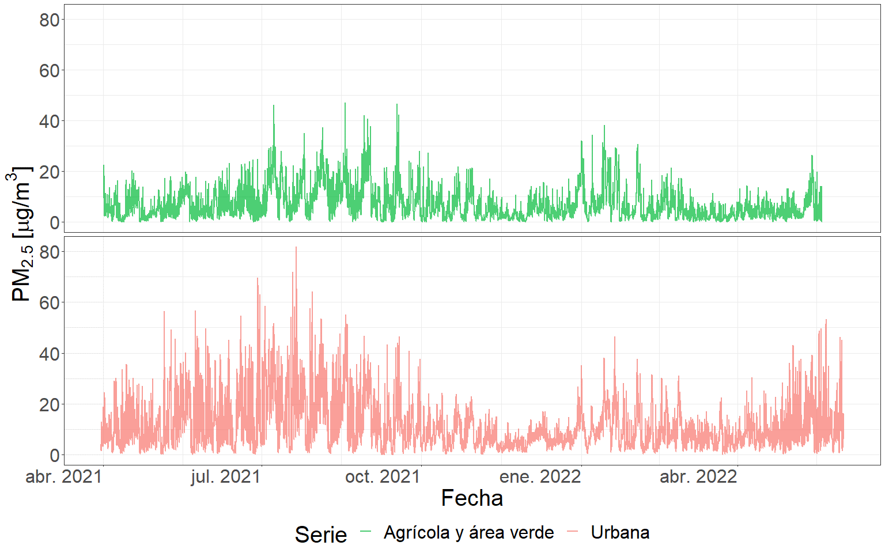

# Variación espacio temporal de la concentración de aerosoles {#cap:expl}
  
## Introducción

  Dentro de los contaminantes más preocupantes en entornos urbanos se hallan las partículas en suspensión, las cuales son principalmente producidas por vehículos, industrias y reacciones fotoquímicas [@seinfeld1998air]. Esta característica debe su origen a la afección que generan tanto en el medio ambiente, como en la salud humana. A pesar de esto, actualmente la provincia de Córdoba no cuenta con un sistema de monitoreo que informe a la población acerca de las condiciones ambientales con respecto a este contaminante. Sin embargo, gracias a la investigación científica se dispone de numerosos estudios en esta ciudad, los cuales además de informar acerca de las concentraciones, variación y composición, también lo hacen respecto de los impactos en la salud humana [@amarillo2021exploratory; @mateos2019influence; @mateos2018land; @busso2021modeling].

  Los estándares de emisión que se emplean en la provincia de Córdoba en cuanto a la reglamentación de la concentración del material particulado (PM) son similares a los que emplea la Agencia de Protección Ambiental (EPA – EEUU), basándose en la Norma Nacional de Calidad del Aire Ambiente (del inglés, NAAQS) [@standard2010environmental]. Por otra parte, los estándares que fija la OMS son más restrictivos y es importante tenerlos presente al analizar concentración de PM fino PM~2.5~ [@organizacion2021global].

  Está comprobado que el PM muestra importantes variaciones estacionales, dado a su fuerte dependencia de las condiciones ambientales. Su concentración varía considerablemente en el espacio y el tiempo en los distintos entornos [@kumar2011dynamics; @hofman2016ultrafine; @peters2014cyclist; @van2013methodology]. En entornos urbanos la variación espacial se encuentra principalmente asociada a la intensidad del tráfico, la topología y la distancia a las fuentes de emisión. Mientras que la variación temporal está asociada al momento en el año, condiciones meteorológicas, dinámica del tráfico y fluctuaciones ambientales [@apparicio2016cyclists; @van2015mobile]. Generalmente, su concentración es mayor durante períodos de bajas temperaturas, estos resultados fueron hallados en ciudades de Austria [@gomivsvcek2004spatial], Grecia [@chaloulakou2003measurements], entre otras partes del mundo. Similar es lo que ocurre en Córdoba, donde la mayor concentración de partículas se produce en la época invernal dado las frecuentes inversiones térmicas que favorecen la concentración y permanencia de contaminantes en las capas inferiores de la atmósfera, particularmente durante la noche y primeras horas de la mañana [@stein1996street; @olcese1997effects; @amarillo2021exploratory; @mateos2019influence].
  
  Los datos que sustentan el análisis espacio temporal desarrollado en la presente tesis son series temporales condicionadas a una localización específica. Una serie temporal se define como una secuencia de valores observados a lo largo del tiempo, por lo tanto, ordenados cronológicamente, en los cuales se destaca una estructura de dependencia entre observaciones [@chatfield2000time], su condicionante de georreferenciación deriva del aspecto espacial. Si conociendo los valores pasados de la serie, no es posible predecir con total certeza el próximo valor de la variable, decimos que la serie es no determinista o aleatoria [@scotto1998introduction; @hamilton2020time]. Los objetivos del análisis de series de tiempo son diversos, pudiendo destacarse la predicción, la clasificación y la simulación de nuevos datos [@chatfield1994time; @pena2005analisis]. El objetivo que se persigue en este capítulo es el de determinar cómo es la variación, tanto espacial como temporal, de la concentración de PM~2.5~ en distintas zonas del área metropolitana de la provincia de Córdoba. De esta forma, en el presente capítulo se describen las series disponibles y se identifican sus patrones de variación, con el fin de contemplar características propias de las series al momento de desarrollar el modelado predictivo (capítulo [3](#cap:comp)).  
  
## Materiales y métodos

### Área de estudio

  La ciudad de Córdoba es la capital de la Provincia de Córdoba y la segunda ciudad más importante del país en cuanto a su población, con aproximadamente 1,3 millones de habitantes y una superficie de 576 $km^2$ [@indec2010censo]. Su centro urbano está ubicado a 470 metros sobre el nivel del mar y dado que, la ciudad se encuentra rodeada por un cordón montañoso, durante el invierno ocurren eventos de inversión térmica que producen el estancamiento de los contaminantes del aire en una fina capa (200 metros) sobre la superficie [@stein1996street ; @olcese2002some]. Estudios realizados sobre las fuentes de aerosoles dentro de la ciudad revelan que la principal es el tránsito (85% de la emisión total de partículas), seguido por la re suspensión del polvo de calles y edificios en construcción [@stein1996street ; @achad2013retrieving]. Una gran variedad de industrias se ubican en la periferia de la ciudad, incluyendo metalmecánica, alimentarias, metalúrgicas, entre otras. El crecimiento de la flota circulante, la falta de control de emisiones y el escaso uso de convertidores catalíticos, ha producido un incremento considerable en las emisiones de partículas [@lopez2011elemental]. A pesar del crecimiento sostenido de la ciudad en las últimas décadas, el microcentro sigue siendo el lugar donde se concentran las actividades económicas, culturales, educativas, financieras, de prestación de servicios y administrativas, lo cual determina una gran demanda de acceso vehicular y transporte público de pasajeros. Se estima que de los aproximadamente 150 millones de pasajeros anuales que transporta el servicio público de transporte, más del 90% desciende/asciende en el centro [@martin2005contaminacion; @serio2020revision]. 
  
  Para la construcción de la base de datos de PM~2.5~ se llevaron a cabo muestreos simultáneos de concentración de PM~2.5~ en ocho sitios seleccionados sobre distintos usos de suelo. Cada sitio se monitoreo durante un periodo de un año y tres meses, desde el 30/03/2021 hasta el 01/06/2022. En total, se recopilaron alrededor de 70.000 datos horarios.

  Cabe destacar que los datos fueron tomados cada 10 segundos, frecuencia temporal que facilitó la limpieza y procesamiento de los mismos, así como la obtención de medias horarias que representan de mejor forma la tendencia a largo plazo de las series.
  
```{r ubicacion, echo=FALSE, out.width="100%", fig.align="center",fig.cap="(ref:ubicacion)"}
knitr::include_graphics("images/imagescap2/Sitios_Satelital_plot.png")
```
(ref:ubicacion) Ubicación específica de los sitios de muestreo.

  Descripción de cada uno de los sitios de muestreo, incorporando la interpretación de los inventarios de emisión de PM~2.5~ publicados por Enrique Puliafito para la Argentina [@puliafito2009gestion] y una comparación con la clasificación de uso de suelo de zonas climáticas locales (LCZ) [@stewart2012local]:

  1. Ciudad Universitaria (urbano): La Facultad de Ciencias Exactas, Físicas y Naturales de la Universidad Nacional de Córdoba se encuentra ubicada en la Ciudad Universitaria, en el centro sur de la Ciudad, sitio donde se concentran las principales dependencias de toda la universidad. Su principal característica es el gran número de personas que frecuentan diariamente la zona usando todo tipo de medios de transporte como motocicletas, automóviles y colectivos, además de otros que no generan emisiones como lo son a pie y en bicicleta. Es una zona con una gran cantidad de espacios verdes donde la cobertura del suelo es compartida por la vegetación, el pavimento y la edificación. La principal fuente de emisión detectada en el sitio es el tránsito vehicular [@puliafito2009gestion]. Dentro de la clasificación LCZ, este sitio se clasificaría como LCZ5~8~, una combinación de las categorías *open midrise* y *large low-rise*, la primera hace referencia a una disposición abierta de edificios de mediana altura (3-9 plantas), donde abunda la cubierta de suelo permeable (plantas bajas, árboles dispersos) y cuyos materiales de construcción son principalmente hormigón, acero, piedra y vidrio. Mientras que la segunda y menos importante categoría hace referencia a un uso de suelo urbano con un notable tráfico de vehículos.  

  2. Casa Radical (urbano): La Casa Radical, ubicada en barrio Nueva Córdoba, en el centro de la Ciudad, es un edificio donde se llevan a cabo actividades políticas como reuniones y debates del partido radical. En sus alrededores se encuentran gran cantidad de edificios residenciales con numerosos pisos. Además, este sitio se encuentra frente al Boulevard San Juan, una de las calles más transitadas de la ciudad, donde además de edificios residenciales hay numerosas empresas de servicios y locales comerciales. La vegetación que caracteriza la zona es escasa y las principales fuentes de emisión detectadas son el tráfico vehicular, la residencial y el comercio [@puliafito2009gestion]. Dentro de la clasificación LCZ, este sitio se clasificaría como LCZ2~8~, una combinación de las categorías *compact midrise* y *large low-rise*, donde la primera hace referencia a un sitio que posee una mezcla densa de edificios de mediana altura (3-9 pisos), con muy poca vegetación (pocos o ningún árbol), donde la superficie se encuentra mayoritariamente pavimentada y cuyos materiales de construcción son principalmente roca, ladrillo, teja y hormigón. Mientras que la segunda y menos importante categoría hace referencia a la disposición abierta de edificios que existe.

  3. Tablada Park (urbano): Se trata de un hogar familiar ubicado en el barrio residencial Tablada Park, en la zona noroeste de la Ciudad Capital de la provincia de Córdoba. Este sitio se encuentra muy cercano a la calle Rodríguez Del Busto, con numerosos locales comerciales y supermercados y posee un alto tránsito vehicular. Los alrededores del sitio se caracterizan por ser viviendas residenciales y comercios. Las principales fuentes de emisión detectadas en el sitio son el tránsito vehicular, la residencial y el comercio [@puliafito2009gestion], además la vegetación en la zona es moderada. Dentro de la clasificación LCZ, este sitio se clasificaría como LCZ3~6~, una combinación de las categorías *compact low rise* y *open low rise*, donde la primera hace referencia a una mezcla densa de edificios de baja altura (1-3 pisos), cuya superficie se encuentra mayoritariamente pavimentada con pocos o ningún árbol y donde los principales materiales de construcción son roca, ladrillo, teja y hormigón. Mientras que la segunda categoría, hace referencia a la presencia de árboles y plantas que caracterizan la zona. 

  4. Alta Córdoba (urbano): Se trata de un hogar familiar ubicado en el barrio residencial Alta Córdoba, en la zona centro norte de la Ciudad. Este sitio se encuentra sobre la calle Mariano Fragueiro que aglomera los principales comercios de la zona y posee un alto tránsito vehicular. Los alrededores del sitio se caracterizan por ser hogares residenciales y locales comerciales. Las principales fuentes de emisión detectadas en el sitio son el tránsito vehicular, la residencial, el comercio y los trenes [@puliafito2009gestion], además la vegetación en la zona es baja. Dentro de la clasificación LCZ, este sitio se clasificaría como LCZ3, una combinación de las categorías *compact low rise* y *open low rise*, la cual hace referencia a una mezcla densa de edificios de baja altura (1-3 pisos), cuya superficie se encuentra mayoritariamente pavimentada con pocos o ningún árbol y donde los principales materiales de construcción son piedra, ladrillo, teja y hormigón.
  
  5. La Reserva (urbano): La Reserva Natural Urbana San Martín se ubica en la zona noreste de la de la Ciudad, al margen de la Avenida de Circunvalación de Córdoba; su actividad principal es proteger y preservar alrededor de 115 hectáreas de bosques nativos, además de concientizar acerca de la protección del medio ambiente. A pesar de ser un área verde donde predomina la cobertura de vegetación, existe una gran cantidad de barrios residenciales rodeándola, generando aportes de contaminantes provenientes del tránsito vehicular y residenciales. Además, este sitio cuenta con un camping que promueve las actividades recreativas al aire libre y que es frecuentado por un gran número de personas principalmente durante los fines de semana. Las principales fuentes de emisión detectadas en el sitio son el tránsito vehiculary la residencial [@puliafito2009gestion]. Dentro de la clasificación LCZ, este sitio se clasificaría como LCZB~A9~, una combinación de las categorías *scattered tres*, *dense trees* y *sparsely built*, donde la primera hace referencia a un sitio con un paisaje ligeramente arbolado de especímenes de hoja caduca y/o de hoja perenne, cuya cobertura del suelo es mayoritariamente permeable (plantas bajas) y su función principal es la de una zona de bosque natural, cultivo de árboles o parque urbano. Mientras que la segunda categoría busca dar información acerca de la gran densidad de árboles que existe en los alrededores y la tercer categoría hace referencia a la disposición dispersa de construcciones de pequeño y mediano tamaño.

  6. Río Ceballos (agrícola y área verde): Se trata de un hogar familiar ubicado en las afueras de la Ciudad de Río Ceballos, que se caracteriza por tener un uso de suelo de área verde. Este sitio se encuentra ubicado en una zona de sierras donde predomina la cobertura de vegetación y los principales accesos son calles no pavimentadas. Es un sitio prácticamente prístino, donde las principales fuentes de PM pueden ser consideradas la re suspensión de polvo de las calles e incendios generados como consecuencia de la quemaya sea de residuos o bien de biomasa. La principal fuente de emisión detectada en la zona es la ganadería; el tránsito vehicular en los alrededores es muy reducido. Dentro de la clasificación LCZ, este sitio se clasificaría como LCZA~B9~, una combinación de las categorías *dense trees*, *scattered tres* y *sparsely built*, donde la primera hace referencia a un sitio con un paisaje muy arbolado, de especímenes de hoja caduca y/o de hoja perenne, cuya cobertura del suelo es mayoritariamente permeable (plantas bajas) y donde su función principal es de zona de bosque natural, cultivo de árboles o parque urbano. Mientras que la segunda categoría representa las zonas poco arboladas que existen en los alrededores y la tercer categoría hace referencia a la disposición dispersa de construcciones de pequeño y mediano tamaño.
  
  7. Campo Escuela (agrícola y área verde): El Campo Escuela de la Facultad de Ciencias Agropecuarias de la Universidad Nacional de Córdoba, se encuentra ubicado camino a Capilla de los Remedios, al sur este de la de la Ciudad, la población más cercana es Villa Corazón de María y se caracteriza por tener un uso de suelo agrícola. En este sitio se lleva a cabo la formación práctica de los alumnos de la Facultad de Ciencias Agropecuarias por lo cual se desarrollan actividades vinculadas a la agricultura y la ganadería. La cobertura de vegetación es abundante y sus calles no se encuentran pavimentadas. Las principales fuentes emisión de PM detectadas en la zona son la agricultura y la ganadería [@puliafito2009gestion]. Dentro de la clasificación LCZ, este sitio se clasificaría como LCZD~9~, una combinación de las categorías *low plants* y *sparsely built*, donde la primera hace referencia a un sitio con un paisaje principalmente de hierbas, plantas o cultivos, con pocos árboles y cuya función principal es de pasto natural, agrícola o parque urbano. Por otra parte, la segunda categoría refleja disposición dispersa de construcciones de pequeño y mediano tamaño.

  8. Juarez Celman (agrícola y área verde): Se trata de un campo productivo ubicado en la ciudad de Juárez Celman al norte de la Ciudad Capital, caracterizado por tener un uso de suelo agrícola. En él se desarrollan actividades productivas agropecuarias, la cobertura de vegetación es alta y sus calles no se encuentran pavimentadas. Este sitio se encuentra al margen de la Ruta Nacional 9, la cual podría generar un aporte de PM importante debido al tránsito vehicular. Las principales fuentes de PM detectadas en la zona son el tránsito vehicular, la agricultura y la ganadería [@puliafito2009gestion]. Dentro de la clasificación LCZ, este sitio se clasificaría como LCZD~9~, una combinación de las categorías *low plants* y *sparsely built*, donde la primera categoría hace referencia a un sitio con un paisaje principalmente de hierbas, plantas o cultivos, con pocos árboles y cuya función principal es de pasto natural, agrícola o parque urbano. Por otra parte, la segunda categoría refleja disposición dispersa de construcciones de pequeño y mediano tamaño.

  Las características descritas para cada uno de los sitios de muestreo determinan el uso de suelo que los representa en función de su patrón de emisión. El uso de suelo agrícola y área verde, agrupa los sitios de Campo Escuela, Juárez Celman y Río Ceballos, mientras que el uso de suelo urbano contempla los sitios de Casa Radical, Ciudad Universitaria, Tablada Park, Alta Córdoba y La Reserva.

### Preprocesamiento de datos

  Previo al análisis del patrón promedio de la serie de concentración de PM~2.5~ y la construcción de una base de datos a escala temporal horaria se llevó a cabo un proceso de depuración de datos. Este trabajo busca comprender la variabilidad macro o promedio de la serie de concentración de PM~2.5~ y no la debida a causas atípicas de la micro escala. Por este motivo, se optó por implementar un estricto protocolo de depuración de datos puntuales aberrantes, excluyendo aquellos eventos puntuales atípicos que no representan la variabilidad promedio de la concentración de PM~2.5~. La fundamentación del enfoque de preprocesamiento implementado se halla sustentado en los objetivos específicos de la tesis, donde se refleja la búsqueda de la relación existente entre la variabilidad promedio de la concentración de PM~2.5~ a lo largo del año con distintas variables satelitales. Las influencias atípicas de la micro escala no aportan a describir el patrón general o promedio de los datos, a menos que estas se repitan de forma reiterada, entonces dejarían de ser atípicas y formarían parte del patrón general o promedio. Por otra parte, el objetivo final que se persigue es el modelado predictivo de la concentración de PM~2.5~ ante condiciones normales o típicas y no para eventos raros. El preprocesamiento de los datos fue dividido en dos etapas, una primera en la que se examinaron valores atípicos globales y otra en la que el estudio se centró en el análisis de datos aberrantes en distintas escalas temporales.
  
  Una vez obtenidos los datos de PM~2.5~ espaciados por un intervalo de tiempo de 10 segundos, se procedió a filtrar aquellos valores que se alejaban en más de 5 desvíos estándares de la media y que cuyo patrón de incremento de la concentración era en forma de un salto repentino, es decir que el crecimiento de la concentración no fue paulatino y continuo en el tiempo. Siendo la media de toda la base de datos de 14.39 $\frac{\mu g}{m^3}$ y la desviación estándar de 102.77 $\frac{\mu g}{m^3}$, se procedió a eliminar aquellos valores que superaban el valor de 528.26 $\frac{\mu g}{m^3}$ describiendo un salto repentino de concentración. De esta forma se logró eliminar aquellos valores atípicos cuya concentración se veía fuertemente influenciado por eventos particulares, propios de la microescala que no representaban la concentración para el sitio en un momento determinado. Posteriormente, se procedió a calcular las medias horarias para los distintos sitios.

  A partir de la base de datos horaria, se procedió a ajustar distintas distribuciones a la variable respuesta con el objetivo de determinar cuál era la que mejor la caracterizaba. La distribución que menores valores del criterio de información de Akaike (AIC) y del criterio de información bayesiano (BIC) entregó fue la *gamma*. A partir de este resultado fue que se procedió a ajustar un Modelo Lineal Generalizado Mixto que vinculaba la variable respuesta y las distintas variables indicadoras de la escala temporal (hora, día, mes, semana, estación) como variables de efectos aleatorios. Los resultados indicaron que la mayor variabilidad de la base de datos era explicada por las variables mes y hora. De esta forma, para cada uno de los sitios de muestreo se procedió a agrupar los datos en cada uno de los meses y las distintas horas del día con el objetivo de calcular medidas de resumen estadísticas (media y desvió estándar) para cada una de las combinaciones. Posteriormente, se filtraron aquellos valores que, para un determinado sitio de muestreo, en un mes particular y a una hora determinada se alejaba en más de 10 desvíos estándares de la media de cada caso particular. 
  
\begin{equation*} 
\log{E(y_i)}= \beta_{1} \mathrm{Hora}_{i} + \beta_{2} \mathrm{Dia}_{i} + \beta_{3} \mathrm{Mes}_{i} + \beta_{4} \mathrm{Semana}_{i}  + \beta_{5} \mathrm{Estacion}_{i}
\end{equation*} 
  
  De esta forma, se realizó una limpieza de valores atípicos a nivel global seguida por una limpieza temporal que aseguró que los datos no estuvieran influenciados por efectos aislados de la microescala que pudieran atentar contra el patrón general de los mismos.
  
### Análisis estadístico

  En primera instancia se buscó explorar gráficamente la variabilidad temporal existente de la serie de concentración media horaria de PM~2.5~ en las distintas escalas temporales, con el objetivo de identificar las tendencias, ciclos y patrones que influyen esta serie de tiempo.
  
  En segundo lugar se llevo a cabo un análisis de la concentración de PM~2.5~ en cada uno de los sitios de muestreo, con el objetivo de demostrar la influencia de las condiciones propias de la ubicación espacial en la concentración del contaminante.

  Luego se exploró la variabilidad temporal de la serie en cada uno de los usos de suelo, con el objetivo de verificar si las tendencias respecto del análisis promedio realizado en primera instancia se encontraba presente en cada uno de los usos especificados. 
  
  Ademas, este análisis se complementó con uno netamente descriptivo y comparativo entre las series temporales para cada uno de los usos de suelo.

## Resultados y discusión

#### Filtrado *outliers* globales.

  En esta etapa de preprocesamiento se excluyeron las observaciones de PM~2.5~ que se encontraban alejados de la media por más de 4 desvíos estándares. Como resultado de este proceso, se excluyeron un total de 5 datos, cuyos valores de PM~2.5~ se correspondían con eventos anómalos sucedidos en los sitios durante el muestreo, como por ejemplo, incendios cercanos o caídas del sensor. Estos valores resultaban notablemente diferentes al resto de los datos.

#### Filtrado *outliers* temporales.

  En primer lugar, se determinó cuál era la distribución que mejor ajustaba a la variable respuesta. Los resultados evidenciaron que la distribución *gamma* logro minimizar los criterios de AIC y BIC. Una vez establecida la distribución se procedió a ajustar un Modelo Lineal Generalizado Mixto, con el objetivo de determinar cuáles variables temporales explicaban mayor porcentaje de varianza.

Table: Variabilidad explicada por las componentes temporales de la base de datos.\label{tab:comptemp}
Referencia: Componente temporal; varianza estimada; desviación estándar estimado; porcentaje de varianza explicado relativo al total.

| Componente |Varianza |Desviación estándar|Porcentaje de varianza|
|------------|:--------------:|:--------------:|:--------------:|
| Hora | 0.070 | 0.265 |  4.975 |
| Mes | 0.172 | 0.414 | 12.184 |
| Día | 0.011 | 0.106 |  0.797 |
| Semana | 0.001 | 0.026 |  0.049 |
| Estación | 0.033 | 0.173 |  2.083 |
| Residual | 1.155 | 1.075 | 79.912 |

  A partir de la tabla \@ref(tab:comptemp), los meses del año son la variable temporal que más influye en la explicación de la variabilidad de la variable respuesta, seguida de las horas del día.
  
  Una vez obtenidos estos resultados se procedió a filtrar aquellas observaciones que, para un mismo sitio, mes del año y hora del día, se encontraban a más de cuatro desvíos estándares de su respectiva media. El filtro aplicado removió un total de 273 valores, lo que representan el 0.4% de la base de datos.

#### Análisis horario

```{r pmhorariolinea, echo=FALSE, out.width="100%", fig.align="center", fig.cap="(ref:pmhorariolinea)"}

```
(ref:pmhorariolinea) Perfil de concentración promedio horario de PM~2.5~ a lo largo de las horas del día.

  La figura \@ref(fig:pmhorariolinea) ilustra el patrón de variabilidad de la concentración promedio horaria de PM~2.5~ a lo largo de las horas del día. Este se caracteriza por mostrar un mínimo de concentración entre las 15 y 17 horas, delimitado por dos picos que ocurren por la mañana entre las 7 y 9 horas y por la noche entre las 21 y 23 horas. Este patrón de concentración horaria puede estar influenciado por diversos factores, como los patrones de emisión de las fuentes de contaminación, la estabilidad de la atmósfera, los patrones de tráfico, entre otros.
  
#### Análisis diario

```{r pmdialineageneral, echo=F, out.width="100%", fig.align='center', fig.cap="(ref:pmdialineageneral)"}

```
(ref:pmdialineageneral) Perfil de concentración promedio diario de PM~2.5~ a lo largo de los días de la semana.

  En la figura \@ref(fig:pmdialineageneral) puede apreciarse el patrón de variabilidad de la concentración promedio diaria de PM~2.5~ a lo largo de los días de la semana. La tendencia observada es un aumento en las concentraciones de PM~2.5~ a medida que nos adentramos en la semana, con un pico máximo de concentración los días miércoles y jueves. En contraste, los días domingo se registran las concentraciones más bajas de PM~2.5~y a partir de ese día, éstas aumentan gradualmente hasta alcanzar su punto máximo durante la mitad de la semana. A partir de ese punto, se observa un descenso gradual en las concentraciones hasta llegar al fin de semana. Esta tendencia semanal podría encontrarse principalmente influenciada por los patrones de movilidad de la población, estrechamente vinculados con su comportamiento a lo largo de los días de la semana.

```{r pmdialinea, echo=F, out.width="100%", fig.align='center', fig.cap="(ref:pmdialinea)"}

```
(ref:pmdialinea) Perfil de concentración promedio horario de PM~2.5~ en cada día de la semana a lo largo de la semana.

  En la figura \@ref(fig:pmdialinea) puede apreciarse el patrón de variabilidad de la concentración de PM~2.5~ a lo largo de las horas del día en los distintos días de la semana. Puede observarse una clara estacionalidad, demostrando que las concentraciones de PM~2.5~ en una hora determinada son similares a lo largo de los distintos días de la semana. Además, las concentraciones guardan un mayor parentesco en su magnitud mientras más próximos entre sí se encuentren los días de la semana.

#### Análisis mensual

```{r pmmeslineageneral, echo=F, out.width="100%", fig.align='center', fig.cap="(ref:pmmeslineageneral)"}

```
(ref:pmmeslineageneral) Perfil de concentración promedio mensual de PM~2.5~ a lo largo del año.

  En la figura \@ref(fig:pmmeslineageneral), se aprecian las concentraciones de PM~2.5~ promedio mensuales registradas a lo largo de los distintos meses del año. Puede notarse que las mayores concentraciones fueron registradas durante los meses de mayo, junio, julio y agosto, mientras que en los meses de noviembre, marzo y diciembre se registraron las menores concentraciones.

```{r pmmeslinea, echo=F, out.width="100%", fig.align='center',  fig.cap="(ref:pmmeslinea)"}

```
(ref:pmmeslinea) Perfil de concentración promedio horario de PM~2.5~ para cada mes a lo largo del año.

  En la figura \@ref(fig:pmmeslinea) se destaca el patrón de variabilidad en la concentración del PM~2.5~ a lo largo de las horas del día en los distintos meses del año, el cual refleja que el ciclo de concentración de PM~2.5~ a lo largo de las horas del día muestra una forma similar a lo largo de los distintos meses. En otras palabras, las caídas de concentración se dan de entre las 12 y 18 horas, mientras que los picos máximos pueden apreciarse entre las 6 y 12 horas y luego de las 18 horas. Además, el parentesco entre los ciclos guarda una mayor correlación mientras más cercanos se encuentren los meses a lo largo del año.

#### Análisis por estación del año

```{r pmest, echo=F, out.width="100%", fig.align='center', fig.cap="(ref:pmest)"}

```
(ref:pmest) Perfil de concentración promedio por estación de PM~2.5~ a lo largo del año.

  La figura \@ref(fig:pmest) muestra el patrón de variabilidad en la concentración de PM~2.5~ promedio a lo largo de las diferentes estaciones del año. Puede notarse que las mayores concentraciones se registraron en las estaciones de otoño e invierno. Por otro lado, las menores concentraciones se registraron durante la primavera y el verano. Estos resultados indican una clara dependencia de la concentración de PM~2.5~ con la estación del año.

```{r pmestacionhora, echo=F, out.width="100%", fig.align='center',  fig.cap="(ref:pmestacionhora)"}
knitr::include_graphics("images/imagescap2/pmestacionhora.png")
```
(ref:pmestacionhora) Perfil de concentración promedio horario de PM~2.5~ para cada estación a lo largo del año.

  La figura \@ref(fig:pmestacionhora) destaca el patrón de variabilidad de la concentración de PM~2.5~ a lo largo de las horas del día en las distintas estaciones del año. Puede notarse que la concentración de PM~2.5~ varía en magnitud según la estación del año, siendo más elevadas en invierno y otoño, mientras que en primavera y verano las concentraciones son menores. Además, se evidencia que, dentro de cada estación, las concentraciones de PM~2.5~ presentan un patrón similar a lo largo de las distintas horas del día. Este patrón evidencia que a lo largo de las horas del día ocurren dos picos de concentraciones, con valores de menor magnitud entre las 12 y 20 horas.

  Las características temporales descritas en la serie de tiempo, demuestran la existencia de ciclos y patrones repetitivos en su perfil de variación. La estadística descriptiva indica que la variación de las condiciones meteorológicas a lo largo de los meses y estaciones del año influye notablemente en la concentración de PM~2.5~. La meteorología característica entre los meses de mayo a agosto favorecen condiciones adversas de calidad de aire, mientras que el resto del año estas se ven atenuadas (inversiones térmicas características del invierno).

#### Descripción de la concentración promedio de PM~2.5~ en cada uno de los sitios de muestreo

Table: Concentración promedio anual de PM~2.5~ en cada sitio de muestreo.\label{tab:concanual}
Referencias: Sitio de muestreo; concentración promedio anual de PM~2.5~; desviación estándar.

| Sitio | Concentración| Desviación estándar | 
|--------|:--------:|:--------:|
| Tablada Park (urbano) | 13.89 | ±12.7  |
| Casa Radical (urbano) | 12.1 | ±10.2 |
| Ciudad Universitaria (urbano) | 11.5 | ±10.7 |
| La Reserva (urbano) | 10.3 | ±10.2 |
| Alta Córdoba (urbano) | 9.08 | ±8.60 |
| Campo Escuela (agrícola/área verde) | 8.88 | ±9.22  |
| Río Ceballos (agrícola/área verde) | 6.40 | ±6.36 |
| Juarez Celman (agrícola/área verde) | 6.00 | ±6.88 |

  La concentración media anual de PM~2.5~ registrada para cada uno de los sitios de muestreo (Tabla \@ref(tab:concanual))) exhibe similitud entre sitios del mismo uso de suelo. 
  
Table: Concentración promedio por estación del año de PM~2.5~ en cada sitio de muestreo.\label{tab:concestsit}
Referencias: Sitio de muestreo; concentración promedio estacional de PM~2.5~; desviación estándar. 

| Sitio | Invierno | Otoño | Primavera | Verano | 
|--------|:--------:|:--------:|:--------:|:--------:|
| Tablada Park | 17.6±14.3 | 14.4±13.7 | 6.80±5.91 | 6.30±4.25 |
| Casa Radical | 19.8±12.9 | 11.7±9.52 | 7.85±5.85 | 9.53±7.40 |
| Ciudad Universitaria | 17.6±13.6 | 10.9±10.3 | 7.64±6.69 | 9.92±8.34 |
| La Reserva | 20.0±14.3 | 10.2± 9.42 | 5.79±4.87 | 7.69±6.35 |
| Alta Córdoba | 15.1±12.7 | 10.7±9.79 | 6.00±3.73 | 6.72±5.83 |
| Campo Escuela | 12.4±11.4 | 6.54±6.99 | 6.36±5.29 | 6.21±5.12 |
| Río Ceballos | 9.65±7.96 | 4.78±4.69 | 5.20±5.28 | 6.59±6.34 |
| Juarez Celman | 11.3±9.79 | 4.71±4.43 | 4.30±6.38 | 4.30±4.54 |

  A partir de la tabla \@ref(tab:concestsit), pueden identificarse estaciones en las que las condiciones atmosféricas producen condiciones adversas de calidad de aire. Específicamente, se observan concentraciones máximas durante los meses de mayo, junio, julio y agosto y concentraciones mínimas durante los meses de enero, febrero y diciembre. Además, se destaca que los mayores desvíos estándares ocurren durante el invierno, demostrando ser la estación del año con características más variables de concentración de PM~2.5~. Además, las diferencias entre sitios de muestreo según uso de suelo son mayores en invierno y otoño que en primavera y verano. 

#### Análisis descriptivo de las series temporales de concentración de PM~2.5~ para cada uno de los usos de suelo

#### Análisis horario por uso de suelo
  
```{r pmhoruso, echo=FALSE, out.width="100%", fig.align="center",fig.cap="(ref:pmhoruso)"}

```
(ref:pmhoruso) Perfil de concentración promedio horario de PM~2.5~ a lo largo de las horas del día, discriminado por uso de suelo.

  La figura \@ref(fig:pmhoruso) permite observar el patrón de variabilidad de la concentración promedio horaria de PM~2.5~ a lo largo de las horas del día, discriminado por los distintos usos de suelo. Como puede apreciarse, el patrón de variabilidad en la concentración de PM~2.5~ a lo largo del día es evidente en los sitios con uso de suelo urbano, aunque se presenta en menor medida en el uso de suelo agrícola y área verde.

  En el caso de los sitios con uso de suelo urbano, la concentración promedio horaria de PM~2.5~ presenta un patrón de aumento en la mañana, disminuyendo notablemente por la tarde, para aumentar nuevamente hacia la noche. Por otro lado, en el caso de los sitios con uso de suelo agrícola y área verde, el patrón de variabilidad en la concentración de PM~2.5~ a lo largo del día se encuentra presente, aunque es menos evidente. La figura \@ref(fig:pmhoruso) muestra la presencia del patrón de variabilidad de la concentración promedio horaria de PM~2.5~ en los distintos usos de suelo.

#### Análisis diario por uso de suelo

```{r pmdiausolinea, echo=FALSE, out.width="100%", fig.align="center",fig.cap="(ref:pmdiausolinea)"}

```
(ref:pmdiausolinea) Perfil de concentración promedio diario de PM~2.5~ a lo largo de los días de la semana, discriminado por uso de suelo.

  Además, en la figura \@ref(fig:pmdiausolinea) puede apreciarse que para el uso de suelo urbano, las concentraciones de PM~2.5~ son mayores durante los días hábiles de la semana, mientras que disminuyen en los días de fin de semana, sugiriendo una relación con las actividades laborales y de tráfico vehicular asociadas a estos usos de suelo. Sin embargo, para el uso de suelo agrícola y área verde no logra observase esta variación entre días hábiles y de fin de semana, lo que podría encontrarse vinculado a la variación en las actividades laborales y la notable reducción del tráfico vehicular en estas áreas.

```{r pmdiahorusolinea, echo=FALSE, out.width="100%", fig.align="center",fig.cap="(ref:pmdiahorusolinea)"}

```
(ref:pmdiahorusolinea) Perfil de concentración promedio horario de PM~2.5~ en la horas del día a lo largo de los días de la semana, discriminado por uso de suelo.

   A partir de la figura \@ref(fig:pmdiahorusolinea), puede apreciarse que la concentración de PM~2.5~ sigue un patrón de variabilidad similar a lo largo de los días de la semana, independientemente del uso del suelo, a pesar de que existan diferencias en magnitud. Específicamente, se observa que el uso de suelo urbano presenta magnitudes de concentración superiores al uso de suelo agrícola y área verde. Esto podría encontrarse vinculado a la dinámica de movilidad de la población, siendo el tráfico de vehículos una de las fuentes principales que contribuyen a la variabilidad del PM, de manera similar a lo observado por [@pant2013estimation; @weerakkody2018quantification]. De esta forma en los sitios urbanos, las variaciones en la concentración de PM~2.5~ podrían estar relacionada con la densidad de personas y vehículos que los frecuentan durante los días laborables, la cual es notablemente superior a la de los fines de semana, originando una mayor concentración de partículas durante los días laborables. En consecuencia, puede apreciarse que la concentración de PM~2.5~ aumenta hasta alcanzar un pico los días miércoles o jueves, mientras que la mínima se observa durante los fines de semana, generalmente los días domingo o lunes (Figura \@ref(fig:pmdiausolinea)).
  
  En contraste, en los sitios cuyo uso de suelo es agrícola y área verde, el patrón de variabilidad no es tan evidente debido a que las principales fuentes de emisión no se relacionan directamente ni con la densidad poblacional ni el tránsito vehicular. Por lo tanto, la concentración de PM~2.5~ en estos sitios alcanza su máximo entre los días miércoles a sábados y llega a su mínimo los días domingo o lunes, sin observarse un pico pronunciado durante los días laborables.

#### Análisis mensual por uso de suelo

```{r pmmesuso, echo=FALSE, out.width="100%", fig.align="center",fig.cap="(ref:pmmesuso)"}

```
(ref:pmmesuso) Perfil de concentración promedio mensual de PM~2.5~ a lo largo de los meses del año, discriminado por uso de suelo.

  En la figura \@ref(fig:pmmesuso), puede destacarse la presencia de un ciclo mensual en la concentración del PM~2.5~ para los distintos usos de suelo a lo largo del año. Es evidente que los registros indican concentraciones máximas durante los meses de julio y agosto, mientras que mínimas durante los meses de marzo, abril y noviembre. A pesar de que los ciclos varían en magnitud en los distintos usos de suelo, estos se encuentran presentes en todos ellos. De esta forma podría establecerse que la variabilidad de las condiciones meteorológicas a lo largo de los meses logra explicar gran parte de la variabilidad de la concentración del PM~2.5~, independientemente del uso de suelo considerado. 

#### Análisis según estación del año por uso de suelo

```{r pmestacionuso, echo=FALSE, out.width="100%", fig.align="center",fig.cap="(ref:pmestacionuso)"}

```
(ref:pmestacionuso) Perfil de concentración promedio estacional de PM~2.5~ a lo largo del año, discriminado por uso de suelo.

  En la figura \@ref(fig:pmestacionuso), puede apreciarse que el patrón estacional de concentración de PM~2.5~, previamente observado en la figura \@ref(fig:pmest), se mantiene constante en los distintos usos de suelo, a pesar de variar magnitud entre ellos. De esta forma, puede notarse que, al igual que en el análisis general, se registran menores concentraciones en el sitio con uso de suelo agrícola y área verde. Esto sugiere que la estacionalidad en la concentración del PM se encuentra altamente influenciada por factores climáticos y meteorológicos que actúan de manera similar en los distintos tipos de uso de suelo. Además, los resultados resaltan la importancia de considerar las características específicas del sitio de estudio al momento de evaluar los niveles de contaminación atmosféricay cómo estos pueden variar en función de factores ambientales y de uso del suelo.
  
```{r pmestacionhorauso, echo=FALSE, out.width="100%", fig.align="center",fig.cap="(ref:pmestacionhorauso)"}

```
(ref:pmestacionhorauso) Perfil de concentración promedio horario de PM~2.5~ a lo largo de las horas del día en las distintas estaciones del año, discriminado por uso de suelo.

  En la figura \@ref(fig:pmestacionhorauso) puede observarse el patrón de variabilidad de la concentración promedio horaria de PM~2.5~ a lo largo de las horas del día en las distintas estaciones discriminado en los usos de suelo obtenidos a partir del análisis de clúster realizado. Es interesante destacar que el patrón de variabilidad de la concentración que se observa para el análisis general (figura \@ref(fig:pmest)) se mantiene constante en los distintos usos de suelo, aunque disminuye en magnitud para el uso de suelo agrícola y área verde.
  
  Los resultados sugieren que las condiciones meteorológicas durante la época fría generan condiciones adversas de calidad del aire, independientemente del uso de suelo. Además, es importante mencionar que la concentración promedio horaria de PM~2.5~ en los distintos usos de suelo presenta una tendencia a aumentar durante las horas de la mañana, disminuir en la tarde y aumentar nuevamente durante las horas de la noche.

#### Medidas descriptivas

Table: Medidas descriptivas de series temporales promedio para los distintos usos de suelo. \label{tab:descript}
Referencias: coeficiente de variación (CV) y rango intercuartílico (RI).

| Medida | Urbano | Agrícola y área verde |
|:-----------------------------:|:---------:|:---------:|
| Media | 11.54 | 6.78 |
| Varianza | 97.91 | 37.23 |
| Desvió estándar  | 9.90 | 6.10 |
| CV  | 86% | 90% |
| Máximo | 81.80 | 47.02 |
| Mínimo | 0 | 0 |
| Percentil 50  | 8.41 | 4.92 |
| Percentil 75  | 15.72 | 9.30 |
| Percentil 90  | 25.49 | 15.16 |
| Percentil 95  | 32.11 | 19.57 |
| RI | 7.31 | 4.38 |

  A partir de los datos de la tabla \@ref(tab:descript) puede apreciarse que la media para la serie de datos urbanos es superior que para la serie agrícola y área verde. Este hecho podría llevarnos a interpretar que a primera vista la concentración de PM~2.5~ es superior en entornos urbanos. Sin embargo, es importante destacar que esta medida de posición puede verse influenciada por valores extremos.
  
  Por lo tanto, para realizar la comparación también se ha empleado la mediana o percentil 50. Puede apreciarse que la serie proveniente de entornos urbanos posee un percentil 50 de 8.41 $\frac{\mu g}{m^3}$, indicando que la mitad de los datos toman un valor igual o menor a este. Por otra parte, la mediana para la serie agrícola y área verde es de 4.92 $\frac{\mu g}{m^3}$, reforzando la idea de que las series de datos provenientes de entornos urbanos muestran mayores concentraciones que la proveniente de entornos agrícolas y áreas verdes.

  También puede apreciarse que el valor del percentil 90 para la serie de datos agrícola y de área verde es prácticamente similar al percentil 75 de la serie de datos urbana. Este hecho evidencia en términos generales que un mayor porcentaje de datos se encuentra por debajo del mismo límite numérico, indicando que la serie de datos urbana toma valores de mayor magnitud que la serie de datos agrícola y área verde.
  
  El coeficiente de variación permite concluir que la serie agrícola y área verde posee menor dispersión de datos respecto a su media o lo que es equivalente, mayor concentración de datos en torno a su media respecto de la serie urbana. De esta forma queda en evidencia que la serie de tiempo urbana toma valores de mayores magnitudes que la serie de tiempo agrícola y área verde, encontrándose sus registros más dispersos respecto a su media. Asimismo, es importante destacar que estos resultados son específicos para la zona y el período de estudio y que podrían variar en otras regiones geográficas y períodos de tiempo.

```{r boxplotcomp, echo=FALSE, out.width="100%", fig.align="center", fig.cap="(ref:boxplotcomp)"}

```
(ref:boxplotcomp) Diagrama de violín que compara la concentración promedio horaria de PM~2.5~ en la series con distintos usos de suelo. La media de las serie se encuentra indicada por el punto rojo dentro de la caja.

  A partir de la figura \@ref(fig:boxplotcomp) se puede notar en primer lugar una diferencia en el tamaño de la caja para los distintos usos de suelo, esta diferencia es representativa de la mayor dispersión observada para la serie urbana y la mayor concentración de datos en torno a su media para la serie agrícola y área verde. Además, puede apreciarse la influencia de valores extremos en ambas series generando un corrimiento de la media respecto de la mediana, este corrimiento es superior para la serie de datos urbana, indicando un mayor porcentaje de valores extremos.

```{r seriescomp, echo=FALSE, out.width="100%", fig.align="center", fig.cap="(ref:seriescomp)"}

```
(ref:seriescomp) Serie de tiempo de la concentración promedio horaria de PM~2.5~ en entornos de distinto uso de suelo.

  A partir de la figura \@ref(fig:seriescomp) puede notarse que se trata de series temporales que logran diferenciarse en función de sus comportamientos a lo largo del tiempo. Es importante destacar que la serie agrícola y de área verde muestra un rango de variación significativamente inferior en comparación con la serie urbana. Puede observase que los valores de la serie urbana oscilan en un rango de magnitud mucho mayor en comparación con la serie agrícola y de área verde. La serie de datos urbana demuestra ser más inestable, pasando desde picos de elevada magnitud a valores mínimos de forma sucesiva y repetitiva a lo largo del tiempo.
  
## Conclusión
  
  La distribución teórica que minimizó los valores del criterio de información de Akaike (AIC) y del criterio de información bayesiano (BIC), demostrando el mejor ajuste a los datos de concentración PM~2.5~ fue la distribución *gamma*. 
  
  Las características temporales de la serie de concentración de PM~2.5~ permiten explicar parte de la variabilidad de la misma. A su vez las características espaciales, referidas a la ubicación y la influencia diferencial de la micro escala en cada uno de los usos de suelo, permite explicar la discrepancia en la magnitud de concentraciones de PM~2.5~ existentes.
  
  Las características temporales de la serie promedio de concentración de PM~2.5~ se mantienen constantes independientemente del uso de suelo, reflejando el mismo patrón de variación a lo largo de las distintas escalas temporales. A pesar de mostrar un patrón de variación similar, puede destacarse que el mismo se ve atenuado en cuanto a la magnitud de las concentraciones en la serie agrícola y área verde en comparación con la serie urbana. Este hecho refleja que el patrón de variación de la concentración de PM~2.5~ responde a una dinámica temporal similar, que se encuentra fuertemente influenciada por las condiciones espaciales de los sitios que se estén analizando.  
  
  El análisis exploratorio confirmó la diferencia existente entre las series temporales provenientes de distintos usos de suelo. La serie de datos proveniente de entornos agrícolas y área verde demostró concentraciones de menor magnitud, mayor concentración de datos en torno de su media, menores fluctuaciones entre valores de elevada y baja magnitud que la caracterizaron como una serie temporal de menor variabilidad en comparación con la urbana.
  
  La variación de las escalas temporales de mayor magnitud, como los meses y estaciones, podría vincularse a la variación de las condiciones meteorológicas. Esta variación potencial para explicar la variabilidad de la concentración de PM~2.5~ podría ser independientemente del uso de suelo que se esté considerando.