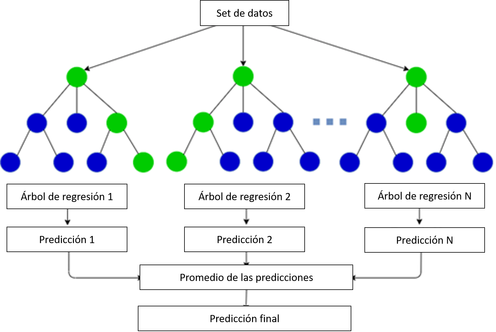
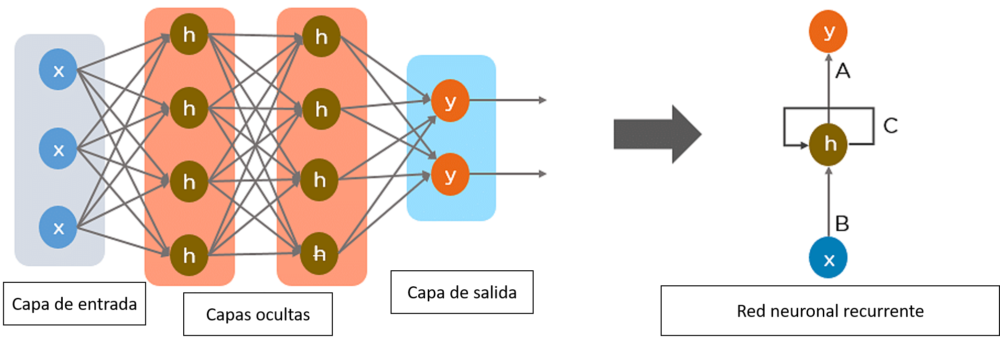
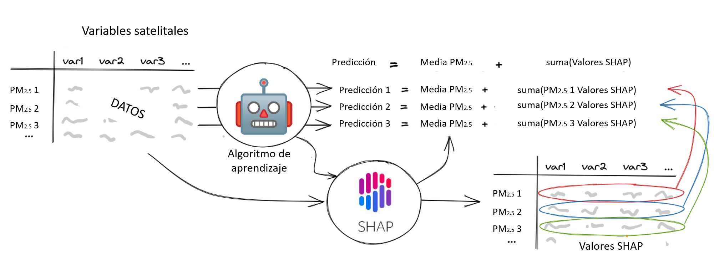
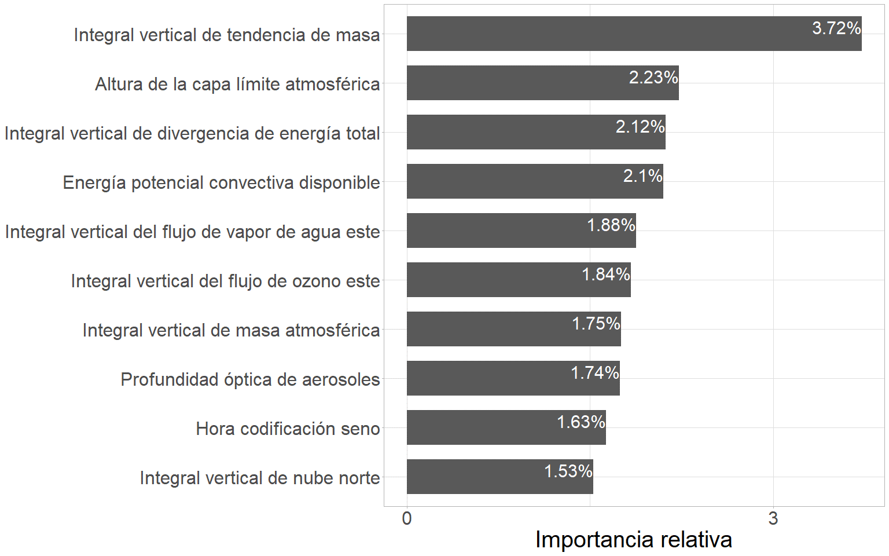
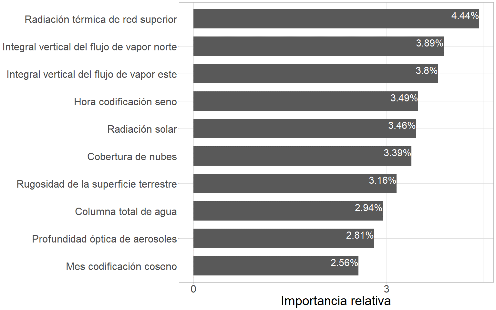
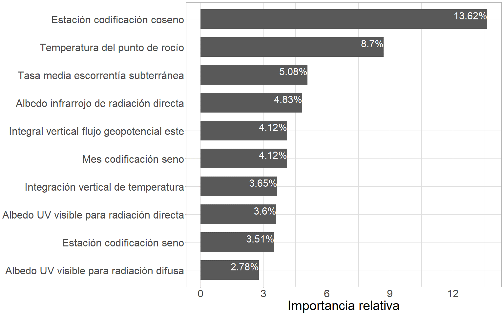
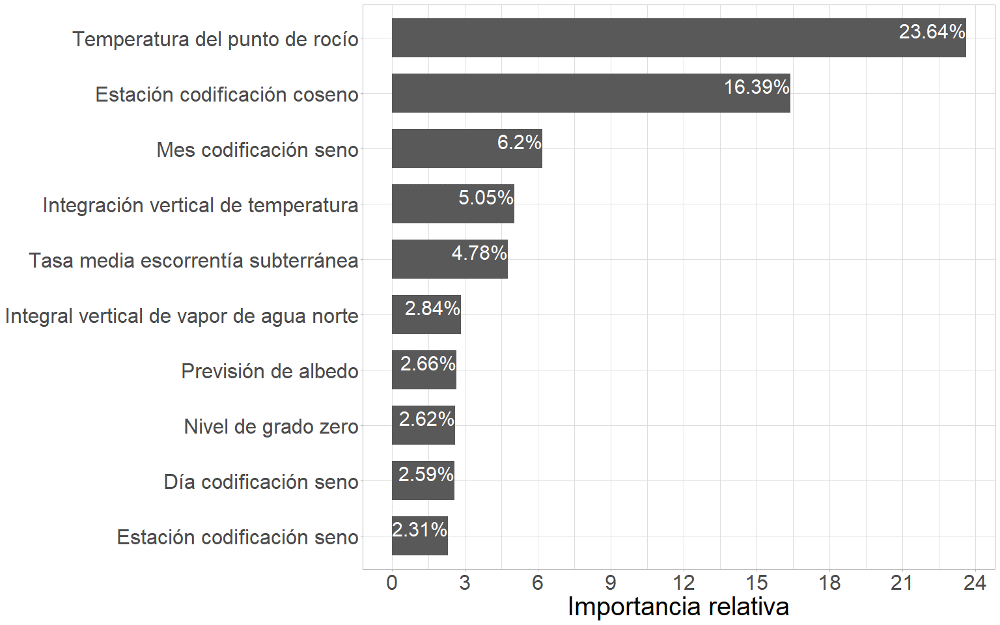

#	Algoritmos para la predicción de la concentración de PM~2.5~ {#cap:comp}

## Introducción

  El modelado predictivo de contaminantes atmosféricos ha tomado gran importancia como base para la implementación de mecanismos de alerta y reducción de este tipo de contaminación. La medición directa del contaminante a través de un sistema de monitoreo no garantiza una cobertura completa del territorio, sin mencionar sus elevados costes de instalación y mantenimiento. Por este motivo, los modelos predictivos ganaron terreno como una forma efectiva de proveer alertas tempranas, con el objetivo de proteger la salud pública [@titus1990greenhouse]. Estas alertas permiten dar aviso a las autoridades con la finalidad de iniciar el plan de mitigación correspondiente para reducir sus impactos. La gestión de la contaminación puede ser abordada a través de la implementación de mecanismos de atenuación de emisiones como lo es la regulación del tráfico [@cesaroni2012health; @font2019tale], como también de reducción de concentración por medio del lavado a través de la pulverización de agua, además es común aplicar medidas más exigentes en sitios donde poblaciones más vulnerables son afectadas. Esta es la razón por la cual puede hallarse una extensiva literatura relacionada al modelado de contaminantes atmosféricos.

  Los métodos de modelado que mejor desempeño han alcanzado en términos de la exactitud de sus predicciones provienen de la rama de la inteligencia artificial [@he2016numerical; @navares2020deep; @navares2020predicting; @shang2019novel]. El aprendizaje automático es una subárea de la inteligencia artificial, cuyo propósito recae en la creación de algoritmos que aprendan las interrelaciones existentes entre las señales de entrada y las de salida. Mediante el aprendizaje automático se posibilita la creación de programas capaces de derivar el comportamiento de una variable respuesta (variable de salida) a partir de la información de las características (variables de entrada) en un momento dado. Cabe destacar que el aprendizaje profundo es un conjunto de algoritmos de aprendizaje automático que busca modelar abstracciones de alto nivel en los datos usando arquitecturas computacionales que incluyen transformaciones no lineales de forma sucesiva sobre los datos de base [@bengio2013representation; @yeo2021efficient; @tong2019deep].

  La fluctuación de las condiciones meteorológicas que determinan el estado de la atmósfera en un momento determinado generan una notable influencia en la variación de la concentración de material particulado fino (PM~2.5~) [@tiwari2017assessment; @he2017influences]. Numerosos estudios han evidenciado estas asociaciones, en su mayoría encontrando un vínculo inverso con respecto al material particulado (PM), las variables citadas en la literatura como explicativas de este patrón son: la velocidad del viento [@cichowicz2020effect; @usman2022exploring; @xiaoyang2019particulate], la precipitación [@usman2022exploring; @xiaoyang2019particulate], la temperatura [@nogarotto2020review; @xiaoyang2019particulate], el punto de rocío [@zhao2022analysis] y la altura de la capa límite atmosférica (PBLH) [@li2020correlation; @wang2019relationship]. Por otra parte, existen variables que responden a una relación directa como la profundidad óptica de aerosoles (AOD) [@soni2018particulate; @gupta2021spatio] y el tráfico de vehículos [@pant2013estimation; @weerakkody2018quantification]. Tanto para la presión atmosférica, como para la humedad relativa, existen resultados que vinculan las variables tanto de forma directa [@li2015particulate; @nogarotto2020review] como inversa [@tian2014characteristics; @chen2016spatial]. Es pertinente destacar la existencia de estudios cuyas conclusiones reflejan que la concentración de PM depende más de la meteorología que de factores antropogénicos [@hooyberghs2005neural]. Esta relación de vinculación está sujeta a otras características propias del sitio, como por ejemplo las fuentes de emisión, el tamaño de las partículas [@khan2010characterization; @tai2010correlations; @dimitriou2015dependence] y la topografía [@alvarado2010modeling; @vinoj2022role].
  
  Enmarcado dentro del Servicio de Cambio Climático Copernicus (Copernicus Climate Change Service - C3S) de la Agencia Espacial Europea (ESA), el Centro Europeo para Previsiones Meteorológicas a Medio Plazo (European Centre for Medium-Range Weather Forecasts - ECMWF) genera grandes conjuntos de datos climáticos a escala global. Para ello se combinan modelos climáticos y datos observacionales de todo el mundo. Este producto es la quinta generación de Reanálisis Europeo (European ReAnalysis - ERA5), sucesor de ERA-Interim [@munoz2021era5]. Estos productos, ponen a disposición información para todo el mundo a escala temporal horaria, diaria y mensual desde el año 1979. Así, cada vez es más factible mapear y modelar las variaciones o cambios espacio-temporales de las condiciones meteorológicas imperantes antes, durante y después de eventos de interés. El avance de la tecnología ha permitido un desarrollo notable en la capacidad computacional disponible, sumado a la disponibilidad de datos meteorológicos masivos en diversas plataformas de Internet, es posible obtener información meteorológica variada para un sitio georreferenciado sobre un territorio de interés. Actualmente, se cuenta con variadas herramientas informáticas para la obtención de productos satelitales almacenados en la nube. Tales productos pueden ser usados como covariables con potencialidad predictiva de la concentración de PM. Sin embargo, aun cuando existen modelos predictivos mecanicista basados en la estimación de efectos para variables reportadas en la literatura, el desarrollo de modelos de base empírica sustentados en la abundancia de información hoy disponible es más incipiente.
  
  En esta tesis se compararon distintos enfoques de modelado predictivo basados en el aprendizaje automático y aprendizaje profundo implementando como datos de entrada variables meteorológicas, ambientales y temporales, obtenidas principalmente de satélites. El objetivo de este trabajo es ajustar un modelo predictivo capaz de ser empleado como sistema de alerta ante condiciones adversas de concentración de PM~2.5~. 

## Materiales y métodos

### Base de datos

  La base de datos para el desarrollo de esta sección surge de la combinación de los datos recopilados durante el muestreo de PM~2.5~ (ver capítulo [2](#cap:expl) para más detalles) con distintas variables generadas a partir de información satelital. Entre estas se destacan las variables generadas por el modelo de ERA5, que surge del reanálisis realizado por el Centro Europeo de Previsión Meteorológica a Plazo Medio (ECMWF) para el clima global [@hersbach2020era5; @bell2021era5]. Este método de estimación combina modelos predictivos con observaciones a lo largo de todo el mundo, dando por resultado un conjunto de datos completo a escala global, cuyo principio de funcionamiento se basa en la asimilación de datos. ERA5 permitió disponer de información de 164 variables atmosféricas, oceánicas y terrestres, que fueron incorporadas a la base de datos para desarrollar la tesis. Estas estimaciones cuentan con una resolución temporal de una hora y una espacial de 0.25 grados. Además, se incluyeron otras covariables, citadas en la literatura como relevantes para el PM~2.5~, provenientes de las mediciones del sensor MODIS a bordo de los satélites Terra y Aqua de la Administración Nacional de Aeronáutica y el Espacio (NASA) [@savtchenko2004terra; @lyapustin2019maiac; @lyapustin2018modis; @hulley2014thermal], datos obtenidos a partir del análisis retrospectivo de la era moderna para investigación y aplicaciones, versión 2 (MERRA-2) [@bosilovich2015merra] y la base de datos de Google Traffic [@wu2007google]. Una descripción completa de cada una de las variables involucradas se encuentra en el Anexo 2.
  
Table: Fuentes de datos de variables derivadas a partir de información satelital. \label{tab:satdata}
Referencia: Fuente de datos, dependencia, resolución espacial, resolución temporal y número total de variables descargadas. Variables especificas descargadas de cada uno de los productos satelitales: MODIS-MAIAC (MCD19A2) *Optical_Depth_047* (*Blue band (0.47 ${\mu m}$) aerosol optical depth over land*), MERRA-2 (M2T1NXFLX) *PBLH* (*planetary boundary layer height *), MERRA-2 (M2I3NXGAS) *AODANA* y *AODINC* (*Aerosol Optical Depth Analysis* y *Aerosol Optical Depth Analysis Increment*), VIIRS (VNP14A1) *FireMask* (*Confidence of fire*) y MODIS (MOD11A1/MYD11A1) *LST_Day_1km* y *LST_Night_1km* (*Daytime Land Surface Temperature* y *Nighttime Land Surface Temperature*).

| Fuente | Dependencia | Espacial | Temporal | Variables |
|----------|:--------:|:--------:|:--------:|:--------:|:--------:| 
| ERA5 (ECMWF reanálisis) | ECMWF | 0.25°x0.25° | horaria | 164 |
| MODIS-MAIAC (MCD19A2) | NASA | 0.1°×0.1° | 3 a 5 (hora) | 1 |
| MERRA-2 (M2T1NXFLX) | NASA  | 0.625°×0.5° | horaria | 1 |
| MERRA-2 (M2I3NXGAS) | NASA  | 0.625°×0.5° | 1 (3 horas) | 1 |
| MERRA-2 (SODA) | NASA | 0.625°×0.5° | horaria | 9 |
| VIIRS (VNP14A1) | NASA | 0.1°×0.1° | diaria | 1 |
| MODIS (MOD11A1/MYD11A1) | NASA | 0.1°×0.1° | horaria | 1 |

  Las variables temporales (estación, mes, día del mes, día de la semana y hora de la lectura del contaminante) fueron incluidas en su forma categórica original y luego de ser codificadas de manera cíclica a través de la inclusión de sus senos y cosenos. Es importante destacar que todas las variables numéricas se estandarizaron o normalizaron con el objetivo de homogeneizar sus rangos de variabilidad y ajustar su desviación estándar a 1. Este proceso permitió evitar problemas de escala y facilitó la comparación entre las variables.

### Protocolo estadístico

#### Métodos de inteligencia artificial comparados

  La **regresión lineal múltiple** (*multiple linear regression*) es una técnica estadística que se utiliza para modelar una variable dependiente como combinación lineal de múltiples variables independientes. Este tipo de análisis es aplicable tanto a datos de sección transversal como a series temporales [@aldas2017analisis]. El supuesto subyacente en el modelo es que existe una relación lineal entre la variable dependiente y las variables independientes. El aprendizaje de la interrelación entre las variables se logra mediante el ajuste de los coeficientes de regresión, estimados a partir del conjunto de datos de entrenamiento y validados con los de testeo. La regresión lineal busca determinar el hiperplano que mejor ajusta a los datos de entrenamiento, lo cual implica encontrar los coeficientes que minimicen la diferencia entre los valores observados y predichos por el modelo. El ajuste fue llevado a cabo por medio del método de mínimos cuadrados ordinarios, este ajusta un modelo lineal cuyos coeficientes resultantes buscan minimizar la sumatoria cuadrada de residuos entre los valores observados en el conjunto de datos de entrenamiento, y los valores predichos por la aproximación lineal. Luego los resultados son validados a través de las predicciones en el conjunto de datos de testeo. 
 
  En los últimos años ha aumentado el interés en los métodos de aprendizaje automático que usan ensambles de modelos como los **bosques aleatorios** (*random forest*) [@breiman1996bagging]. Estos métodos combinan los resultados de múltiples modelos independientes para mejorar el rendimiento predictivo del modelo ensamblado (Figura \@ref(fig:rfalgo)). Uno de los métodos de ensamblado más reconocido es el empaquetado (*bagging* o *bootstrap aggregating*) [@breiman1996bagging]. El empaquetado crea múltiples conjuntos de datos mediante remuestreo con reemplazo de los datos de entrenamiento. Al combinar los resultados de los modelos estimados en cada uno de los conjuntos de datos obtenidos por remuestreo, se aumenta la estabilidad y precisión de las predicciones, porque se reduce la varianza.
 
```{r rfalgo, echo=FALSE, out.width="100%", fig.align="center", fig.cap="(ref:rfalgo)"}

```
(ref:rfalgo) Diagrama de funcionamiento del algoritmo de bosques aleatorios.

  Posteriormente, Breiman [@breiman2001random] propuso el modelo de bosques aleatorios, que añade una capa de aleatoriedad en las variables de entrada a cada uno de los empaquetados, proporcionando mayor robustez contra el sobreajuste. Al ajustar el modelo, se considera un número limitado de variables predictoras elegidas aleatoriamente. Esta aleatoriedad hace que cada uno de los subconjuntos de datos considere distintos subconjuntos de variables predictoras garantizando mayor independencia entre los modelos estimados a partir de las distintos subconjuntos generados por el remuestreo.

  En resumen, el algoritmo de bosques aleatorios combina los resultados de múltiples árboles de regresión independientes, cada uno generado sobre distintos subconjuntos de datos creados a partir de los datos originales y agrega las predicciones resultantes de los distintos árboles a través de un promedio.

  Las **redes neuronales artificiales** (*artificial neural networks (ANN)*) son algoritmos que permiten modelar procesos no lineales de manera eficiente, a partir de la información de entrada recolectada a través de un vector denominado capa de entrada. Una vez ingresada la información se propaga y fluye capa a capa de la red, estableciendo las relaciones entre la capa de entrada y la capa final denominada de salida. El aprendizaje de las interrelaciones entre las variables predictoras se desarrolla a través del ajuste de parámetros característicos de este tipo de modelo denominados pesos sinápticos. Las capas intermedias u ocultas consisten en múltiples unidades denominadas neuronas que se encuentran interconectadas con las neuronas de las capas anterior y posterior. El número de capas ocultas y el número de neuronas en cada una de ellas define la topología de la red (Figura \@ref(fig:redalgo)). Cada neurona genera una respuesta excitatoria a las señales recibidas por medio de una función de activación. Existen distintas funciones, de las cuales algunas pueden resultar más recomendadas para un objetivo y problema en particular [@bishop1995neural; @hayakin1999learn]. 

  El aprendizaje de la red se basa en capturar las relaciones entre la capa de entrada y de salida a partir de la optimización de una métrica de error. En los problemas de regresión la métrica más implementada es la raíz del error cuadrático medio (*RMSE*), la cual se calcula comparando las salidas predichas por la red con los valores observados. A partir de la pérdida registrada es que se genera una actualización de los pesos sinápticos mediante el algoritmo de retropropagación (*backpropagation*) [@rumelhart1986learning]. Una de las mayores dificultades de este tipo de enfoque es encontrar la topología de red que mejor ajuste a los datos. Este proceso normalmente se aborda a partir del ajuste iterativo de múltiples arquitecturas. Generalmente, se parte de una red simple de una capa oculta y pocas neuronas, y se procede aumentando la complejidad de la red (incrementando secuencialmente el número de neuronas, así como el número de capas ocultas) hasta obtener un modelo satisfactorio que optimice los resultados.

  Las **redes neuronales recurrentes** (*recurrent neural network (RNN)*), a diferencia de las tradicionales, incluyen bucles o conexiones entre unidades que permiten que la información persista en los sucesivos capas de la red (Figura \@ref(fig:redalgo)). La capacidad de incorporar información sobre el contexto pasado en sus sucesivas salidas las hace especialmente prometedores para tareas en las que la información pasada es relevante para la predicción, como en el caso de series temporales. Las *RNN* pueden ser consideradas como múltiples copias de la misma red neuronal actuando conjuntamente, cada una de las cuales transfiere información a su sucesora y forma una arquitectura en cadena capaz de preservar la información de la secuencia. Las *RNN* son eficientes implementando información pasada en un intervalo de tiempo corto, es decir reciente, para realizar una tarea de predicción. Sin embargo, la información relevante no siempre está cercana al pasado y, a medida que aumenta el intervalo de tiempo, las *RNN* no logran conectar la información para realizar las predicciones, de esta forma disminuye su capacidad predictiva cuando la información importante se encuentra contenida en mayores desfasajes de tiempo. 
 
```{r redalgo, echo=FALSE, out.width="100%", fig.align="center", fig.cap="(ref:redalgo)"}

```
(ref:redalgo) Diagrama de funcionamiento del algoritmo de redes neuronales recurrentes.

  Para solventar esta falencia, en 1997 fueron introducidas las **redes de memoria a corto plazo** (*Long Short-Term Memory (LSTM)*) por Hochreiter y Schmidhuber [@hochreiter1997long] y mejoradas en el 2000 por Gers et al. [@gers2000learning]. Estas son una variación de las *RNN* capaz de aprender dependencias de largo plazo, gracias a la inclusión de unidades especiales llamadas bloques de memoria. Además, de otras unidades multiplicativas llamadas puertas que controlan el flujo de información de una unidad *LSTM* a otra. Una variante de este tipo de red es la **red recurrente con compuerta** (*Gated Recurrent Unit (GRU)*), introducidas por Cho et al. [@cho2014properties], las cuales mantienen las características propias de las *LSTM* con una estructura más simple, reduciendo la cantidad de parámetros a ajustar y permitiendo una ejecución de mayor rapidez y eficiencia. 

#### Metodología de modelado
 
  Se evaluaron múltiples alternativas para desarrollar el ajuste del modelo predictivo de concentración de PM~2.5~, entre ellas distintas formas de condicionarlo, con el objetivo de aumentar el desempeño en la obtención de predicciones. Se generaron modelos para cada estación del año (4 modelos predictivos), día de la semana (7 modelos predictivos), mes del año (12 modelos predictivos), hora del día (24 modelos predictivos) y uso del suelo (2 modelos predictivos). Mediante estadística descriptiva se determinó que el uso del suelo es una fuente de variación importante de las series temporales de PM~2.5~. Y por ello el desarrollo del algoritmo predictivo fue llevado a cabo condicionado por esta variable, de forma que se entrenaron dos algoritmos predictivos, uno para cada uno de los usos de suelo presente en la base de datos.
   
  El entrenamiento de los algoritmos predictivos se realizó con un desfasaje de la variable respuesta respecto a las predictoras de 120 horas, es decir, cinco días, con el objetivo de obtener un modelo predictivo que permita disponer de predicciones de concentración de contaminantes atmosféricos con cinco días de anticipación. Este desfasaje se haya fundamentado en que la disponibilidad de los datos de ERA5 de forma gratuita se obtiene con una latencia de 120 horas. De esta forma, en el momento presente se dispone de datos que ocurrieron hace 120 horas. De allí surge la necesidad de realizar el entrenamiento del modelo con las variables desfasadas para que el modelo, en función de lo que ocurrió hace 120 horas, logre predecir lo que sucederá en la hora siguiente.

#### Selección de variables 

  Fueron analizadas tres alternativas respecto de la cantidad de variables predictoras a incluir en el modelado predictivo. De esta forma pudo determinarse si los algoritmos resultantes de mejor ajuste se mantenían constantes bajo distintas versiones de la base de datos o si la selección de variables estaba jugando un rol fundamental en los resultados obtenidos. Las alternativas evaluadas contemplaron el ajuste bajo una base de datos que involucrase todas las variables regresoras (base de datos original), otra que involucra las seleccionadas por el algoritmo LASSO y otra base de datos que involucra las variables seleccionadas por el algoritmo featurewiz. Todos los análisis se realizaron con la versión 3.10 de Python, empleando diferentes módulos, entre ellos *scikit-learn*, un módulo de aprendizaje automático creado a partir del paquete *scipy* para la selección por LASSO, y *featurewiz*, una biblioteca de Python para crear y seleccionar las características más importantes de una base de datos, para aplicar la selección del algoritmo de featurewiz.
  
  El algoritmo LASSO es una técnica de selección de variables que utiliza una penalización (L1) para reducir la complejidad del modelo y mejorar su capacidad de generalización. Su objetivo es encontrar el subconjunto óptimo de variables más relevantes para desarrollar un modelo predictivo. Para lograr esto, LASSO minimiza una función de costo regularizada, que introduce un término de penalización L1 (Ecuación 2). La penalización actúa como un mecanismo de selección de variables, ya que algunos coeficientes de regresión se reducirán a cero, lo que indica que las variables correspondientes no contribuyen significativamente al modelo. Una de las características útiles de LASSO es que permite reducir la dimensionalidad de los datos al eliminar las variables menos importantes [@robert1994regression].

\begin{equation*} 
Loss = Error(Y - \widehat{Y}) + \lambda \sum_1^n |w_i| \tag{2}
\end{equation*}
\begin{flushleft}
\setstretch{0.5}
{\footnotesize Especificar que es cada elemento
\textit{RMSE} PM$_{2.5}$ [$\frac{\mu g}{m^3}$] \textit{RMSE} PM$_{2.5}$}
\end{flushleft}

  El algoritmo *featurewiz* [@bakheet2023hybrid; @novaes2022modelo; @hu2023glass], surge de la combinación de dos algoritmos de selección de características. En primer lugar, emplea el algoritmo de *SULOV* (*Searching for Uncorrelated List of Variables*), el cual se encuentra basado en el algoritmo de *MRMR* (*Minimum-Redundancy-Maximum-Relevance*) [@radovic2017minimum]. Este permite reducir la base de datos a un número óptimo de variables no correlacionadas que contienen la máxima información mutua con respecto a la variable respuesta. Una vez que *SULOV* ha seleccionado las variables más relevantes, se emplea un método de eliminación recursiva de variables (*RFE* de *Recursive Feature Elimination*). La *RFE* es un método de selección de características que ajusta de forma iterativa un algoritmo predictivo a una base de datos, eliminando aquellas características de menor importancia, hasta alcanzar el número optimo de variables que permiten maximizar el desempeño predictivo. El algoritmo de *featurewiz* emplea una eliminación recursiva basada en el algoritmo predictivo de *XGBoost*, el cual es un método de ensamblado (*ensamble*) perteneciente a la familia de los algoritmos de *boosting*, cuya característica principal es que el entrenamiento del modelo predictivo se genera de forma secuencial [@chen2015xgboost; @chen2016xgboost]. De esta forma, el algoritmo de *featurewiz* posteriormente a la reducción por *SULOV* aplica un algoritmo de *XGBoost Recursivo*. De esta forma, el algoritmo logra encontrar el conjunto óptimo de características, que permite entrenar un modelo de aprendizaje automático robusto.
  
  Las variables incluidas en cada una de las bases de datos original y reducidas por selección de características, para cada uno de los usos de suelo se encuentran descriptas en el Anexo 1.

#### Metodología de entrenamiento
 
  La metodología implementada para llevar a cabo el ajuste y evaluación de los modelos predictivos, constó en un procedimiento iterativo de división de datos, entrenamiento del modelo y evaluación por medio de las métricas de desempeño. La base de datos fue dividida en subconjuntos de entrenamiento, validación y testeo a partir de un muestreo aleatorio estratificado por meses, días y horas. Esta estratificación buscó maximizar la representatividad de las distintas condiciones temporales existentes en los distintos subconjuntos de datos para el ajuste del modelo predictivo. Las respectivas proporciones de los datos para cada uno de los subconjuntos (entrenamiento, validación y testeo), fue de 70%, 15% y 15%, respectivamente. Posteriormente se procedió a ajustar cada uno de los algoritmos de modelado predictivo (regresión lineal múltiple, bosques aleatorios y redes neuronales recurrentes) en la base de datos de entrenamiento y validación. Una vez entrenados los modelos se prosiguió con el cálculo de las predicciones tanto en la base de datos de entrenamiento como en la de testeo, a partir de estas predicciones se llevó a cabo el cálculo de las métricas de desempeño en ambas particiones de los datos. Este procedimiento de entrenamiento y evaluación del modelo predictivo fue realizado de forma iterativa un total de diez veces por medio de la variación de las semillas aleatorias que determinaron las particiones que dieron origen a cada uno de los subconjuntos de datos. Finalizada la iteración, se llevo a cabo el cálculo promedio de las métricas de desempeño para las diez corridas del procedimiento tanto para la base de datos de entrenamiento como la de testeo. Finalmente se compararon los resultados promedio de las métricas de desempeño a partir de los cuales se determinó cúal de los algoritmos predictivos fue el que generó el ajuste de mayor capacidad predictiva. 
  
#### Optimización modelo predictivo
 
  Todos los algoritmos predictivos ajustados fueron optimizados durante el procedimiento iterativo de entrenamiento y evaluación a partir de las particiones de entrenamiento y validación. Esta optimización se llevó a cabo variando los valores de los hiperparámetros, hasta obtener los valores de los mismos que garantizaron el ajuste de mayor desempeño predictivo. Además, para el caso de las redes neuronales se profundizó en el estudio de diferentes arquitecturas para llevar a cabo el modelado predictivo. 
 
#### Criterio para interpretar los resultados del modelo
 
  Las contribuciones de cada una de las variables a las predicciones se cuantificaron con el método de los valores de las explicaciones aditivas de Shapley (SHAP) [@lubo2020machine]. Los valores SHAP son una medida de atribución a las variables que permite interpretar modelos complejos de aprendizaje automático. Cada valor SHAP es la contribución de cada variable independiente a una predicción individual específica, para el caso de la concentración de PM~2.5~, en unidades de $\frac{\mu g}{m^3}$. En concreto, el valor SHAP para un predictor y una observación dada es la diferencia existente en los resultados de predicción entre un modelo que se ajusta incluyendo y excluyendo a dicho predictor. Para cada observación, la suma de todos los valores SHAP, más la media general (concentración media global de PM~2.5~ en los datos de entrenamiento), es igual a la predicción del modelo predictivo (Figura \@ref(fig:shapalgo)). La matriz resultante de los valores SHAP puede resumirse para comprender cómo contribuye cada predictor a las predicciones resultantes. El valor SHAP absoluto medio de todas las observaciones resume la contribución global de cada variable predictora, y es posible una interpretación local del modelo mediante la visualización a través de un gráfico de dispersión que compare los valores de dicha variable y la contribución SHAP que generan dichos valores.

```{r shapalgo, echo=FALSE, out.width="100%", fig.align="center", fig.cap="(ref:shapalgo)"}

```
(ref:shapalgo) Diagrama de funcionamiento del algoritmo de valores SHAP.


#### Evaluación del modelo predictivo

  Para comparar el desempeño predictivo de los distintos algoritmos ajustados tanto en el conjunto de datos de entrenamiento como en el de testeo, se implementaron cinco métricas de rendimiento: la raíz del error cuadrático medio de predicción ($RMSE$), el error absoluto medio ($MAE$), el coeficiente de determinación ($R^2$), el coeficiente de correlación al cuadrado ($r^2$) y el coeficiente de concordancia de Lin ($CCC$).

  Raíz del error cuadrático medio (*root mean squared error ($RMSE$)*): expresa el promedio de la diferencia cuadrática entre los valores predichos por el modelo y los valores observados [@hyndman2006effect]. Esta es siempre no negativa, y un valor de 0 (poco común en la práctica) indicaría un ajuste perfecto a los datos. Generalmente, mientras menor $RMSE$ mejor ajuste o mayor exactitud en las predicciones. Esta métrica es sensible a valores atípicos y pone mayor peso en los grandes errores, ya que su coeficiente elevado al cuadrado influirá notablemente en el resultado [@lehmann2006theory; @pontius2008components; @willmott2006use].

\begin{equation*}
RMSE = \sqrt{\frac{1}{n}\sum\nolimits_{i=1}^N(y_i-\hat{y_i})^2} \tag{3}
\end{equation*}
\begin{flushleft}
\setstretch{0.5}
{\footnotesize Especificar que es cada elemento
\textit{RMSE} PM$_{2.5}$ [$\frac{\mu g}{m^3}$] \textit{RMSE} PM$_{2.5}$}
\end{flushleft}

  Error absoluto medio (*mean absolute error ($MAE$)*): mide la media de las diferencias absolutas entre los valores predichos por el modelo y los valores observados, siendo menos sensible a valores atípicos a diferencia del $RMSE$. Una ventaja del $MAE$ es que es fácil de interpretar, ya que se mide en las mismas unidades que la variable de respuesta. Un valor de $MAE$ más bajo indica que el modelo es más preciso. 

\begin{equation*}
MAE = \sum_{i=1}^{N}|y_i-\hat{y_i}| \tag{4}
\end{equation*}
\begin{flushleft}
\setstretch{0.5}
{\footnotesize Especificar que es cada elemento
\textit{RMSE} PM$_{2.5}$ [$\frac{\mu g}{m^3}$] \textit{RMSE} PM$_{2.5}$}
\end{flushleft}

  Otra métrica de evaluación de modelos predictivos es el coeficiente de determinación (*coefficient of determination ($R^2$)*). Calculada bajo las predicciones en la base de datos de entrenamiento estima la proporción de la varianza de la variable respuesta que puede ser explicada por el modelo, brindando una medida de bondad de ajuste del modelo. Por otra parte, bajo una base de datos de testeo representa la capacidad predictiva del modelo ajustado. El $R^2$ toma valores entre 0 y 1, donde 0 indica que el modelo no explica nada de la variabilidad de la variable respuesta (entrenamiento), o bien que la capacidad predictiva del modelo es deficiente (testeo), mientras que 1 indica que el modelo explica la totalidad de la variabilidad (entrenamiento), o bien que estamos frente a un modelo perfecto (testeo).

<!-- \begin{equation*}  -->
<!-- $R^2$ = \frac{SSR}{SST} \tag{5} -->
<!-- \end{equation*} -->
<!-- \begin{flushleft} -->
<!-- \setstretch{0.5} -->
<!-- {\footnotesize Especificar que es cada elemento -->
<!-- \textit{RMSE} PM$_{2.5}$ [$\frac{\mu g}{m^3}$] \textit{RMSE} PM$_{2.5}$} -->
<!-- \end{flushleft} -->

  Donde SSR es la suma de regresión al cuadrado también conocida como variación explicada por el modelo y SST es la variación total en los datos también conocida como suma total al cuadrado.

\begin{equation*} 
SSR = \sum\nolimits_{i=1}^N(\hat{y_i}-\overline{y})^2 \tag{6}
\end{equation*}
\begin{flushleft}
\setstretch{0.5}
{\footnotesize Especificar que es cada elemento
\textit{RMSE} PM$_{2.5}$ [$\frac{\mu g}{m^3}$] \textit{RMSE} PM$_{2.5}$}
\end{flushleft}

\begin{equation*} 
SST = \sum\nolimits_{i=1}^N(y_i-\overline{y})^2 \tag{7}
\end{equation*}
\begin{flushleft}
\setstretch{0.5}
{\footnotesize Especificar que es cada elemento
\textit{RMSE} PM$_{2.5}$ [$\frac{\mu g}{m^3}$] \textit{RMSE} PM$_{2.5}$}
\end{flushleft}

  Donde $y_i$ es el valor y para la observación i, $\overline{y}$ es la media del valor y y $\hat{y_i}$ es el valor predicho de y para la observación i. 

  El coeficiente de correlación de Pearson (*Pearson’s correlation coefficient (r)*) es una medida estadística que indica el grado de covariación lineal entre dos variables. Este oscila entre valores de 1 y -1, un valor de 1 indica una correlación lineal positiva perfecta, lo que significa que cuando una variable aumenta, la otra variable también aumenta en la misma proporción. Por otra parte un valor de -1 indica una correlación lineal negativa perfecta, lo que significa que cuando una variable aumenta, la otra variable disminuye proporcionalmente. Finalmente un valor de 0 indica que no hay correlación entre las variables involucradas. Es importante destacar que el coeficiente de correlación de Pearson solo mide la asociación lineal entre dos variables, por lo que puede no ser adecuado para evaluar la relación entre variables cuando esta no es lineal. Cabe destacar que en esta tesis la presente métrica se implementa para evaluar tanto la bondad de ajuste como la capacidad predictiva del modelo ajustado, por este motivo las variables comparadas son los valores observados contra los predichos por el modelo ajustado. Su cálculo bajo los resultados de una base de datos de entrenamiento permiten obtener una medida de bondad de ajuste, mientras que bajo los de una de testeo reflejan la capacidad predictiva del modelo ajustado. Se espera que mientras mejor sea el ajuste del modelo, más cercano a 1 sea el valor de esta métrica.  

\begin{equation*}
r = \frac{{}\sum_{i=1}^{n} (x_i - \overline{x})(y_i - \overline{y})} 
{\sqrt{\sum_{i=1}^{n} (x_i - \overline{x})^2(y_i - \overline{y})^2}} \tag{8}
\end{equation*}
\begin{flushleft}
\setstretch{0.5}
{\footnotesize Especificar que es cada elemento
\textit{RMSE} PM$_{2.5}$ [$\frac{\mu g}{m^3}$] \textit{RMSE} PM$_{2.5}$}
\end{flushleft}

  Otra métrica útil para evaluar el ajuste de un modelo es el coeficiente de concordancia de Lin (*Lin's Concordance Correlation Coefficient ($CCC$)*), este evalúa la concordancia entre los valores observados y predichos por el modelo ajustado. A diferencia del coeficiente de correlación de Pearson, el $CCC$ mide la concordancia o acuerdo entre las variables comparadas. Los valores que toma el $CCC$ oscilan entre 1 y -1, donde un valor de 1 indica una concordancia perfecta, mientras que un valor de -1 indica una discordancia perfecta. Un valor de 0 indica que no hay concordancia entre ambas variables. Es importante destacar que el $CCC$ es una métrica más robusta que el coeficiente de correlación de Pearson, ya que no se ve afectado por valores atípicos o distribuciones no normales. Es importante destacar que los resultados obtenidos bajo una base de datos de entrenamiento permiten evaluar la bondad de ajuste del modelo predictivo, mientras que bajo los de una de testeo refleja la capacidad predictiva del modelo ajustado.

\begin{equation*} 
\dfrac{2 s_{12}}{(\overline{x}_{1} - \overline{x}_{2})^{2} + s_{1}^{2} + s_{2}^{2}} \tag{9}
\end{equation*}
\begin{flushleft}
\setstretch{0.5}
{\footnotesize Especificar que es cada elemento
\textit{RMSE} PM$_{2.5}$ [$\frac{\mu g}{m^3}$] \textit{RMSE} PM$_{2.5}$}
\end{flushleft}

  Donde $\overline{x}_{1}$ y $\overline{x}_{2}$ son la media de cada una de las variables, $s_{1}^{2}$ y $s_{2}^{2}$ son la varianza de cada una de las variables y ${s_{12}}$ es su covarianza. 

  Según las métricas calculadas sobre los datos de testeo, valores más bajos de RMSE y MAE y más altos de $R^2$, $r$ y CCC indican un rendimiento del modelo más deseable y predicciones más acertadas, o bien con menos errores.
  
  Por otra parte, estos resultados de RMSE, MAE y $R^2$ evaluadas sobre los datos de entrenamiento, proveen medidas de bondad de ajuste, indicativas de la capacidad del modelo ajustado para explicar la variabilidad en los datos. 

  Además, cabe destacar que para abordar la comparación de la capacidad predictiva de los modelos ajustados se implementó una línea de base contra la cual contrastar los algoritmos ajustados. Esta refiere a un modelo de referencia (*base line*), que predice la concentración de PM~2.5~ para la hora que no se tiene dato como la media de la concentración en la hora anterior y posterior. Cabe destacar que esta predicción no es posible en la práctica, ya que no se dispone de datos de concentración de PM~2.5~ en tiempo real. Un desempeño superior o similar al de este modelo de referencia refleja una elevada capacidad predictiva del modelo ajustado. 

## Resultados 

### Comparación de algoritmos para el uso del suelo urbano 

#### Base de datos original

  En esta sección se desarrolló el modelado predictivo a partir de la base de datos que involucró todas las variables obtenidas a partir de información satelital, una descripción detallada de cada una de ellas puede hallarse en el Anexo 2. La base de datos original empleada para llevar a cabo el modelado predictivo involucró un total de 193 variables predictoras.

Table: Métricas de ajuste de modelos predictivos aplicados en el contexto de aprendizaje automático al set de datos de entrenamiento para el uso del suelo urbano. Los valores de *RMSE* y *MAE* se encuentran en las mismas unidades que la concentración de PM~2.5~, es decir [$\frac{\mu g}{m^3}$]. \label{tab:modurbtrain}
Referencias: Raíz del error cuadrático medio ($RMSE$), error absoluto medio ($MAE$), coeficiente de determinación ($R^2$), coeficiente de correlación de Pearson ($r$) y coeficiente de concordancia de Lin ($CCC$).

| Modelo | $RMSE$ | $MAE$ | $R^2$ | $r$ | $CCC$ |
|------------------|:------:|:------:|:------:|:------:|:------:|
| Redes neuronales recurrentes | 1,657 | 1,174 | 0,972 | 0,987 | 0,986 |
| Bosques Aleatorios | 6,823 | 4,919 | 0,529 | 0,754 | 0,639 |
| Regresión lineal múltiple | 7,840 | 5,788 | 0,378 | 0,615 | 0,548 |
| | | | | | |
| *Modelo de referencia* | 3,740 | 2,316 | 0,859 | 0,929 | 0,929 |

Table: Métricas de ajuste de los algoritmos predictivos de aprendizaje automático en el set de datos de testeo para el uso del suelo urbano. Los valores de *RMSE* y *MAE* se encuentran en las mismas unidades que la variable respuesta, es decir [$\frac{\mu g}{m^3}$].\label{tab:modurbtest}
Referencias: Error cuadrático medio ($RMSE$), error absoluto medio ($MAE$), coeficiente de determinación ($R^2$), coeficiente de correlación de Pearson ($r$) y coeficiente de concordancia de Lin ($CCC$).

| Modelo | $RMSE$ | $MAE$ | $R^2$ | $r$ | $CCC$ |
|------------------|:------:|:------:|:------:|:------:|:------:|
| Redes neuronales recurrentes | 3,747 | 2,472 | 0,857 | 0,927 | 0,924 |
| Bosques Aleatorios | 7,135 | 5,168 | 0,482 | 0,715 | 0,601 |
| Regresión lineal múltiple | 7,929 | 5,888 | 0,360 | 0,601 | 0,540 |
| | | | | | |
| *Modelo de referencia* | 3,740 | 2,326 | 0,858 | 0,930 | 0,930 |

  Los resultados observados en las tablas \@ref(tab:modurbtrain) y \@ref(tab:modurbtest) muestran que las redes neuronales recurrentes demostraron ser el algoritmo predictivo de mejor desempeño para el uso del suelo urbano bajo la base de datos original tanto en el conjunto de datos de entrenamiento como en el de testeo. El desempeño predictivo alcanzado demuestra cómo las características propias de aprendizaje del algoritmo logran captar las fuentes de variabilidad y realizar predicciones acertadas de la variable respuesta. Además, puede apreciarse que los bosques aleatorios y la regresión lineal múltiple no lograron superar el modelo de referencia propuesto, demostrando una menor capacidad predictiva que las redes neuronales recurrentes para la serie de PM~2.5~ para el uso del suelo urbano.  

#### Interpretación del modelo
  
  Exploración de las variables de mayor importancia dada su contribución a las predicciones.

```{r impurb, echo=FALSE, out.width="100%", fig.align="center", fig.cap="(ref:impurb)"}

```
(ref:impurb) Importancia relativa de las variables en el modelo predictivo para la serie de datos urbanos bajo el enfoque de la base de datos original.

  A partir de la figura \@ref(fig:impurb) pueden apreciarse las diez variables de mayor importancia relativa para el modelo predictivo en el uso del suelo urbano bajo la base de datos original. Entre estas se destaca que nueve de las diez son variables derivadas de información satelital. Por otra parte, la variable hora codificación seno que se encuentra vinculada a la escala temporal, sugiere estructura de variación periódica en la concentración de PM~2.5~. Los resultados muestran que estas diez variables reúnen el 20% de la importancia relativa, a su vez las cinco primeras reúnen el 12% y las dos primeras menos del 6%. 

#### Base de datos reducida por el algoritmo LASSO

  En esta sección se desarrolló el modelado predictivo a partir de la base de datos reducida por medio del algoritmo de selección de variables de *LASSO*. La base de datos original quedó reducida a un total de 45 variables predictoras. 

Table: Métricas de ajuste de modelos predictivos aplicados en el contexto de aprendizaje automático al set de datos de entrenamiento para el uso del suelo urbano. Los valores de *RMSE* y *MAE* se encuentran en las mismas unidades que la concentración de PM~2.5~, es decir [$\frac{\mu g}{m^3}$] \label{tab:modurbtrainLASSO}
Referencias: Raíz del error cuadrático medio ($RMSE$), error absoluto medio ($MAE$), coeficiente de determinación ($R^2$), coeficiente de correlación de Pearson ($r$) y coeficiente de concordancia de Lin ($CCC$).

| Modelo | $RMSE$ | $MAE$ | $R^2$ | $r$ | $CCC$ |
|------------------|:------:|:------:|:------:|:------:|:------:|
| Redes neuronales recurrentes | 2,091 | 1,513 | 0,955 | 0,978 | 0,977 |
| Bosques Aleatorios | 6,756 | 4,846 | 0,538 | 0,755 | 0,653 |
| Regresión lineal múltiple | 8,175 | 6,052 | 0,323 | 0,569 | 0,489 |
| | | | | | |
| *Modelo de referencia* | 3,740 | 2,316 | 0,859 | 0,929 | 0,929 |

Table: Métricas de ajuste de los algoritmos predictivos de aprendizaje automático en el set de datos de testeo para el uso del suelo urbano. Los valores de *RMSE* y *MAE* se encuentran en las mismas unidades que la variable respuesta, es decir [$\frac{\mu g}{m^3}$].\label{tab:modurbtestLASSO}
Referencias: Error cuadrático medio ($RMSE$), error absoluto medio ($MAE$), coeficiente de determinación ($R^2$), coeficiente de correlación de Pearson ($r$) y coeficiente de concordancia de Lin ($CCC$).

| Modelo | $RMSE$ | $MAE$ | $R^2$ | $r$ | $CCC$ |
|------------------|:------:|:------:|:------:|:------:|:------:|
| Redes neuronales recurrentes | 3,804 | 2,506 | 0,853 | 0,925 | 0,921 |
| Bosques Aleatorios | 7,049 | 5,068 | 0,494 | 0,719 | 0,619 |
| Regresión lineal múltiple | 8,180 | 6,062 | 0,319 | 0,566 | 0,488 |
| | | | | | |
| *Modelo de referencia* | 3,740 | 2,326 | 0,858 | 0,930 | 0,930 |

  Los resultados observados en la tabla \@ref(tab:modurbtrainLASSO) y \@ref(tab:modurbtestLASSO) muestran que para el caso de una base de datos reducida bajo el algoritmo de LASSO las redes neuronales recurrentes demuestran ser el algoritmo predictivo de mayor desempeño para el uso del suelo urbano tanto en el conjunto de datos de entrenamiento como en el de testeo. Estos resultados son similares a los obtenidos bajo la base de datos original (Tabla \@ref(tab:modurbtrain) y \@ref(tab:modurbtest)). Los resultados obtenidos muestran una capacidad predictiva superior para el caso de las redes neuronales recurrentes en comparación con los demás algoritmos.
  
#### Interpretación del modelo

  Exploración de las variables de mayor importancia dada su contribución a las predicciones.

```{r impurbLASSO, echo=FALSE, out.width="100%", fig.align="center", fig.cap="(ref:impurbLASSO)"}
knitr::include_graphics("images/imagescap3/impurb_LASSO.png")
```
(ref:impurbLASSO) Importancia relativa de las variables en el modelo para la serie de datos urbanos, bajo una base de datos reducida por medio del algoritmo de LASSO.

  A partir de la figura \@ref(fig:impurbLASSO) pueden apreciarse las diez variables de mayor importancia relativa para el modelo predictivo en el uso del suelo urbano bajo una base de datos reducida por el algoritmo de LASSO. Entre estas se destaca que cinco de las diez son variables obtenidas a partir de información satelital, mientras que las restantes cinco son variables temporales, sugiriendo una estructura de variación periódica en la concentración de PM~2.5~. Los resultados muestran que estas diez variables reúnen el 44% de la importancia relativa, a su vez las cinco primeras reúnen el 26% y las dos primeras menos del 15%.
  
#### Base de datos reducida por el algoritmo featurewiz

  En esta sección se desarrolló el modelado predictivo a partir de una base de datos reducida por medio del algoritmo de selección de variables de *featurewiz*. La base de datos original quedó reducida a un total de 66 variables. 

Table: Métricas de ajuste de modelos predictivos aplicados en el contexto de aprendizaje automático al set de datos de entrenamiento para el uso del suelo urbano. Los valores de *RMSE* y *MAE* se encuentran en las mismas unidades que la concentración de PM~2.5~, es decir [$\frac{\mu g}{m^3}$] \label{tab:modurbtrainfeat}
Referencias: Raíz del error cuadrático medio ($RMSE$), error absoluto medio ($MAE$), coeficiente de determinación ($R^2$), coeficiente de correlación de Pearson ($r$) y coeficiente de concordancia de Lin ($CCC$).

| Modelo | $RMSE$ | $MAE$ | $R^2$ | $r$ | $CCC$ |
|------------------|:------:|:------:|:------:|:------:|:------:|
| Redes neuronales recurrentes | 1,943 | 1,390 | 0,960 | 0,981 | 0,980 |
| Bosques Aleatorios | 6,833 | 4,922 | 0,527 | 0,753 | 0,638 |
| Regresión lineal múltiple | 8,234 | 6,121 | 0,313 | 0,560 | 0,477 |
| | | | | | |
| *Modelo de referencia* | 3,740 | 2,316 | 0,859 | 0,929 | 0,929 |

Table: Métricas de ajuste de los algoritmos predictivos de aprendizaje automático en el set de datos de testeo para el uso del suelo urbano. Los valores de *RMSE* y *MAE* se encuentran en las mismas unidades que la variable respuesta, es decir [$\frac{\mu g}{m^3}$].\label{tab:modurbtestfeat}
Referencias: Error cuadrático medio ($RMSE$), error absoluto medio ($MAE$), coeficiente de determinación ($R^2$), coeficiente de correlación de Pearson ($r$) y coeficiente de concordancia de Lin ($CCC$).

| Modelo | $RMSE$ | $MAE$ | $R^2$ | $r$ | $CCC$ |
|------------------|:------:|:------:|:------:|:------:|:------:|
| Redes neuronales recurrentes | 3,897 | 2,587 | 0,845 | 0,921 | 0,918 |
| Bosques Aleatorios | 7,143 | 5,173 | 0,481 | 0,714 | 0,600 |
| Regresión lineal múltiple | 8,265 | 6,173 | 0,305 | 0,553 | 0,473 |
| | | | | | |
| *Modelo de referencia* | 3,740 | 2,326 | 0,858 | 0,930 | 0,930 |

  Los resultados observados en la tabla \@ref(tab:modurbtrainfeat) y \@ref(tab:modurbtestfeat) muestran que para el caso de una base de datos reducida bajo el algoritmo de *featurewiz* las redes neuronales recurrentes demuestran ser el algoritmo predictivo de mayor desempeño para el uso del suelo urbano tanto en el conjunto de datos de entrenamiento como en el de testeo. Estos resultados son similares a los obtenidos para los anteriores enfoques evaluados (Tabla \@ref(tab:modurbtrain), \@ref(tab:modurbtest), \@ref(tab:modurbtrainLASSO) y \@ref(tab:modurbtestLASSO)).

#### Interpretación del modelo

  Exploración de las variables de mayor importancia dada su contribución a las predicciones.

```{r impurbfeat, echo=FALSE, out.width="100%", fig.align="center", fig.cap="(ref:impurbfeat)"}

```
(ref:impurbfeat) Importancia relativa de las variables en el modelo predictivo para la serie de datos urbanos bajo una base de datos reducida por medio del algoritmo de featurewiz.
  
  A partir de la figura \@ref(fig:impurbfeat) pueden apreciarse las diez variables de mayor importancia relativa para el modelo predictivo en el uso del suelo urbano bajo una base de datos reducida por medio del algoritmo de featurewiz. Entre estas se destaca que ocho de las diez son variables obtenidas a partir de información satelital, demostrando la dependencia existente de la variable repuesta respecto de estas. Por otra parte, dos de las variables se hallan vinculadas a la escala temporal, exhibiendo la dependencia de la variable respuesta frente a sus patrones de variación temporal. Los resultados muestran que estas diez variables reúnen el 34% de la importancia relativa, a su vez las cinco primeras reúnen el 20% y las dos primeras menos del 8%.
  
### uso del suelo agrícola y área verde

#### Base de datos original
  
  En esta sección se desarrolló el modelado predictivo a partir de la base de datos original que cuenta con un total de 193 variables predictoras, las cuales se encuentran descriptas en el Anexo 2.

Table: Métricas de ajuste de modelos predictivos aplicados en el contexto de aprendizaje automático al set de datos de entrenamiento para el uso de agrícola y área verde. Los valores de *RMSE* y *MAE* se encuentran en las mismas unidades que la concentración de PM~2.5~, es decir [$\frac{\mu g}{m^3}$]. \label{tab:modaatrain}
Referencias: Error cuadrático medio ($RMSE$), error absoluto medio ($MAE$), coeficiente de determinación ($R^2$), coeficiente de correlación de Pearson ($r$) y coeficiente de concordancia de Lin ($CCC$).

| Modelo | $RMSE$ | $MAE$ | $R^2$ | $r$ | $CCC$ |
|------------------|:------:|:------:|:------:|:------:|:------:|
| Bosques Aleatorios | 1,016 | 0,657 | 0,973 | 0,989 | 0,985 |
| Redes neuronales recurrentes | 1,363 | 0,940 | 0,950 | 0,975 | 0,973 |
| Regresión lineal múltiple | 4,941 | 3,681 | 0,356 | 0,597 | 0,525 |
| | | | | | |
| *Modelo de referencia* | 2,813 | 1,569 | 0,792 | 0,896 | 0,896 |

Table: Métricas de ajuste de los algoritmos predictivos de aprendizaje automático en el set de datos de testeo para el uso de agrícola y área verde. Los valores de *RMSE* y *MAE* se encuentran en las mismas unidades que la variable respuesta, es decir [$\frac{\mu g}{m^3}$]. \label{tab:modaatest}
Referencias: Error cuadrático medio ($RMSE$), error absoluto medio ($MAE$), coeficiente de determinación ($R^2$), coeficiente de correlación de Pearson ($r$) y coeficiente de concordancia de Lin ($CCC$).

| Modelo | $RMSE$ | $MAE$ | $R^2$ | $r$ | $CCC$ |
|------------------|:------:|:------:|:------:|:------:|:------:|
| Bosques Aleatorios | 2,673 | 1,749 | 0,810 | 0,903 | 0,888 |
| Redes neuronales recurrentes | 2,846 | 1,843 | 0,784 | 0,887 | 0,881 |
| Regresión lineal múltiple | 5,013 | 3,741 | 0,334 | 0,579 | 0,511 |
| | | | | | |
| *Modelo de referencia* | 2,718 | 1,554 | 0,804 | 0,903 | 0,903 |
  
  Los resultados observados en las tablas \@ref(tab:modaatrain) y \@ref(tab:modaatest) muestran que el algoritmo predictivo de mayor capacidad son los bosques aleatorios para el uso del suelo agrícola y área verde bajo la base de datos original. Tanto las redes neuronales como los bosques aleatorios superan el modelo de referencia propuesto en la base de datos de entrenamiento, a pesar de esto el algoritmo de bosques aleatorios muestra un mayor exactitud en sus predicciones. Por otra parte, las métricas obtenidas para la base de datos de testeo evidencian que solo el algoritmo de bosques aleatorios supera el modelo de referencia propuesto.

#### Interpretación del modelo

  Exploración de las variables de mayor importancia dada su contribución a las predicciones.

```{r impaa, echo=FALSE, out.width="100%", fig.align="center", fig.cap="(ref:impaa)"}

```
(ref:impaa) Importancia relativa de las variables en el modelo predictivo para la serie de datos agrícola y área verde en la base de datos original.

  A partir de la figura \@ref(fig:impaa) pueden apreciarse las diez variables de mayor importancia relativa para el modelo predictivo en el uso del suelo agrícola y área verde bajo la base de datos original. Se destaca que tres de las diez son variables temporales, entre ellas se encuentra la variable estación codificación coseno la cual es la de mayor importancia relativa. Por otra parte las restantes son variables derivadas a partir de información satelital demostrando la capacidad de las mismas para explicar la variabilidad de la concentración de PM~2.5~. Los resultados muestran que estas diez variables reúnen el 55% de la importancia relativa, a su vez las cinco primeras reúnen el 36% y las dos primeras menos del 22%. 

#### Base de datos reducida por el algortimo de LASSO

  En esta sección se desarrolló el modelado predictivo a partir de la base de datos reducida por medio del algoritmo de selección de variables de *LASSO*. La base de datos original quedó reducida a un total de 40 variables predictoras. 

Table: Métricas de ajuste de modelos predictivos aplicados en el contexto de aprendizaje automático al set de datos de entrenamiento para el uso de agrícola y área verde. Los valores de *RMSE* y *MAE* se encuentran en las mismas unidades que la concentración de PM~2.5~, es decir [$\frac{\mu g}{m^3}$]. \label{tab:modaatrainLASSO}
Referencias: Error cuadrático medio ($RMSE$), error absoluto medio ($MAE$), coeficiente de determinación ($R^2$), coeficiente de correlación de Pearson ($r$) y coeficiente de concordancia de Lin ($CCC$).

| Modelo | $RMSE$ | $MAE$ | $R^2$ | $r$ | $CCC$ |
|------------------|:------:|:------:|:------:|:------:|:------:|
| Bosques Aleatorios | 0,975 | 0,625 | 0,975 | 0,990 | 0,986 |
| Redes neuronales recurrentes | 1,530 | 1,051 | 0,937 | 0,970 | 0,967 |
| Regresión lineal múltiple | 5,250 | 3,879 | 0,273 | 0,523 | 0,429 |
| | | | | | |
| *Modelo de referencia* | 2,813 | 1,569 | 0,792 | 0,896 | 0,896 |

Table: Métricas de ajuste de los algoritmos predictivos de aprendizaje automático en el set de datos de testeo para el uso de agrícola y área verde. Los valores de *RMSE* y *MAE* se encuentran en las mismas unidades que la variable respuesta, es decir [$\frac{\mu g}{m^3}$].  \label{tab:modaatestLASSO}
Referencias: Error cuadrático medio ($RMSE$), error absoluto medio ($MAE$), coeficiente de determinación ($R^2$), coeficiente de correlación de Pearson ($r$) y coeficiente de concordancia de Lin ($CCC$).

| Modelo | $RMSE$ | $MAE$ | $R^2$ | $r$ | $CCC$ |
|------------------|:------:|:------:|:------:|:------:|:------:|
| Bosques Aleatorios | 2,550 | 1,650 | 0,827 | 0,912 | 0,899 |
| Redes neuronales recurrentes | 2,784 | 1,796 | 0,794 | 0,893 | 0,888 |
| Regresión lineal múltiple | 5,241 | 3,900 | 0,272 | 0,523 | 0,430 |
| | | | | | |
| *Modelo de referencia* | 2,718 | 1,554 | 0,804 | 0,903 | 0,903 |

  Los resultados observados en las tablas \@ref(tab:modaatrainLASSO) y \@ref(tab:modaatestLASSO), muestran que el algoritmo predictivo de mayor capacidad son los bosques aleatorios para el uso del suelo agrícola y área verde bajo la base de datos reducida por medio del algoritmo de *LASSO*. Estos resultados fueron similares a los exhibidos para el caso de la base de datos original (Tabla \@ref(tab:modaatrain) y \@ref(tab:modaatest)).

#### Interpretación del modelo

  Exploración de las variables de mayor importancia dada su contribución a las predicciones.

```{r impaaLASSO, echo=FALSE, out.width="100%", fig.align="center", fig.cap="(ref:impaaLASSO)"}
knitr::include_graphics("images/imagescap3/impaa_LASSO.png")
```
(ref:impaaLASSO) Importancia relativa de las variables en el modelo para la serie de datos agrícola y área verde para una base de datos reducida por medio del algoritmo de LASSO.

  A partir de la figura \@ref(fig:impaaLASSO) pueden apreciarse las diez variables de mayor importancia relativa para el modelo predictivo en el uso del suelo agrícola y área verde bajo una base de datos reducida por medio del algoritmo de LASSO. Entre estas se destaca que seis de las diez, son variables obtenidas a partir de información satelital, demostrando la dependencia de la variable repuesta respecto de estas. Por otra parte las restantes son variables vinculada a la escala temporal, lo cual exhibe la importancia de contemplar los patrones de variación temporales a la hora de predecir la concentración de PM~2.5~. Los resultados muestran que estas diez variables reúnen el 65% de la importancia relativa, a su vez las cinco primeras reúnen el 50% y las dos primeras menos del 30%.

#### Base de datos reducida por el algoritmo de featurewiz

  En esta sección se desarrolló el modelado predictivo a partir de una base de datos reducida por medio del algoritmo de selección de variables de *featurewiz*. La base de datos original quedó reducida a un total de 54 variables.
  
Table: Métricas de ajuste de modelos predictivos aplicados en el contexto de aprendizaje automático al set de datos de entrenamiento para el uso de agrícola y área verde. Los valores de *RMSE* y *MAE* se encuentran en las mismas unidades que la concentración de PM~2.5~, es decir [$\frac{\mu g}{m^3}$]. \label{tab:modaatrainfeat}
Referencias: Error cuadrático medio ($RMSE$), error absoluto medio ($MAE$), coeficiente de determinación ($R^2$), coeficiente de correlación de Pearson ($r$) y coeficiente de concordancia de Lin ($CCC$).

| Modelo | RMSE | MAE | $R^2$ | $r$ | CCC |
|:------------------:|:------:|:------:|:------:|:------:|:------:|
| Bosques Aleatorios | 1,020 | 0,662 | 0,973 | 0,989 | 0,985 |
| Redes neuronales recurrentes | 1,432 | 0,992 | 0,944 | 0,973 | 0,971 |
| Regresión lineal múltiple | 5,176 | 3,850 | 0,293 | 0,542 | 0,454 |
| | | | | | |
| *Modelo de referencia* | 2,813 | 1,569 | 0,792 | 0,896 | 0,896 |

Table: Métricas de ajuste de los algoritmos predictivos de aprendizaje automático en el set de datos de testeo para el uso de agrícola y área verde. Los valores de *RMSE* y *MAE* se encuentran en las mismas unidades que la variable respuesta, es decir [$\frac{\mu g}{m^3}$].  \label{tab:modaatestfeat}
Referencias: Error cuadrático medio ($RMSE$), error absoluto medio ($MAE$), coeficiente de determinación ($R^2$), coeficiente de correlación de Pearson ($r$) y coeficiente de concordancia de Lin ($CCC$).

| Modelo | $RMSE$ | $MAE$ | $R^2$ | $r$ | $CCC$ |
|------------------|:------:|:------:|:------:|:------:|:------:|
| Bosques Aleatorios | 2,702 | 1,769 | 0,806 | 0,901 | 0,885 |
| Redes neuronales recurrentes | 2,819 | 1,820 | 0,788 | 0,890 | 0,886 |
| Regresión lineal múltiple | 5,197 | 3,878 | 0,284 | 0,534 | 0,448 |
| | | | | | |
| *Modelo de referencia* | 2,718 | 1,554 | 0,804 | 0,903 | 0,903 |

  Los resultados observados en las tablas \@ref(tab:modaatrainfeat) y \@ref(tab:modaatestfeat), muestran que el algoritmo predictivo de mayor capacidad son los bosques aleatorios para el uso del suelo agrícola y área verde bajo una base reducida por medio del algoritmo de *featurewiz*. Estos resultados fueron similares a los exhibidos para el caso de la base de datos original y la reducida por medio del algoritmo de *LASSO* (Tabla \@ref(tab:modaatrain), \@ref(tab:modaatest), \@ref(tab:modaatrainLASSO) y \@ref(tab:modaatestLASSO)).

#### Interpretación del modelo

  Exploración de las variables de mayor importancia dada su contribución a las predicciones.

```{r impaafeat, echo=FALSE, out.width="100%", fig.align="center", fig.cap="(ref:impaafeat)"}

```
(ref:impaafeat) Importancia relativa de las variables en el modelo para la serie de datos agrícola y área verde para una base de datos reducida bajo el algoritmo de featurewiz. 

  A partir de la figura \@ref(fig:impaafeat) pueden apreciarse las diez variables de mayor importancia relativa para el modelo predictivo en el uso del suelo agrícola y área verde bajo una base de datos reducida por medio del algoritmo de *featurewiz*. Entre estas se destaca que seis de las diez son variables obtenidas a partir de información satelital, mientras que las restantes son variables vinculada a la escala temporal. Los resultados muestran que estas diez variables reúnen el 69% de la importancia relativa, a su vez las cinco primeras reúnen el 56% y las dos primeras menos del 40%.
  
## Discusión

  Es interesante destacar que para el uso del suelo urbano los distintos enfoques de bases de datos exhiben resultados similares en cuanto al algoritmo predictivo de mayor capacidad. El algoritmo de redes neuronales recurrentes obtuvo los resultados de mayor exactitud no solo bajo todos los enfoques de bases de datos, si no también para cada una de sus particiones (entrenamiento y testeo). Resultados similares fueron hallados por Wongrin et al. (2023), demostrando que las redes neuronales recurrentes, en especial las *LSTM* destacan de entre múltiples algoritmos predictivos como las de mayor precisión [@wongrin2023comparison]. Por otra parte, otros estudios también han demostrado la supremacía de las redes neuronales recurrentes para predecir la concentración de PM~2.5~ [@feng2019recurrent; @dhakal2021exploring; @casallas2021long]. En esta tesis la mayor capacidad predictiva para el uso del suelo urbano fue alcanzada por las redes neuronales recurrentes entrenadas bajo la base de datos original, alcanzando una $RMSE$ de 1,657 $\frac{\mu g}{m^3}$ en el set de datos de entrenamiento y una de 3,747 $\frac{\mu g}{m^3}$ en el de testeo.

  Por otra parte, en el uso del suelo agrícola y área verde, el algoritmo predictivo que demostró mayor capacidad fue el de bosques aleatorios, manteniendo constantes sus resultados bajo los distintos enfoques de bases de datos evaluados. Múltiples estudios han expuesto resultados coincidentes con los informados en este trabajo, destacando el algoritmo de bosques aleatorios como el de mayor capacidad para predecir la concentración de PM~2.5~ [@huang2018predicting; @suleiman2020comparative; @chen2018machine; @xu2021influence]. En el presente trabajo la mayor capacidad predictiva para este uso del suelo fue alcanzada por los bosques aleatorios entrenados bajo la base de datos reducida por medio del algoritmo de *LASSO*, alcanzando una $RMSE$ de 1,943 $\frac{\mu g}{m^3}$ en el set de datos de entrenamiento y una de 3,897 $\frac{\mu g}{m^3}$ en el de testeo. 
  
  A partir de los resultados obtenidos para los distintos tipos de modelos predictivos ajustados en el contexto de aprendizaje automático en ambos usos de suelo, puede notarse que el algoritmo predictivo de mejor ajuste varia en función del uso del suelo analizado. Este resultado podría encontrarse vinculado no solo a características propias de cada una de las series temporales, si no también a las de aprendizaje de los algoritmos empleados en el modelado predictivo.

  En primera instancia, el cambio podría encontrarse vinculado a las características propias de la serie temporal en cada uno de los usos de suelo. En el caso de la serie de tiempo para el uso del suelo agrícola y área verde, se observó que las datos de concentración de PM~2.5~ variaban en un entorno reducido respecto de su media. Esto indica una baja dispersión de los datos, lo que se traduce en una baja frecuencia de fluctuación entre valores de elevada y baja magnitud. Esta característica permite que la variable respuesta pueda ser explicada por un menor número de variables predictoras (Figuras \@ref(fig:impaa), \@ref(fig:impaaLASSO) y \@ref(fig:impaafeat)). Por el contrario la variabilidad fue mayor en la serie de concentración de PM~2.5~ correspondiente al uso del suelo urbano.
  
  Es destacable cómo en las primeras cinco variables se reúne un porcentaje considerable de la importancia relativa para explicar la variable respuesta en el uso del suelo agrícola y área verde. Además, puede destacarse que dentro de las diez variables de mayor importancia relativa, bajo los tres métodos de selección de variables para el modelado predictivo siempre se mantienen constantes seis variables predictoras, difiriendo sutilmente en el orden de importancia que reciben. Estas son: temperatura del punto de rocío, estación codificación coseno, integral vertical de temperatura, mes codificación seno, tasa media de escorrentía subterránea y estación codificación seno. El resultado refleja cómo en un número bajo de variables se concentra la información necesaria para modelar la variabilidad de la serie, independientemente del enfoque de modelado que se esté considerando. La concentración de información se debe a la baja variabilidad de la serie la cual requiere menor información para describir sus fluctuaciones que pueden ser explicadas la mayor parte del tiempo por las mismas variables predictoras.
 
  La concentración de información en un número reducido de variables podría favorecer al algoritmo de bosques aleatorios. Los bosques aleatorios resultaron eficientes detectando y utilizando la información de las variables de mayor importancia en la base de datos. Una vez detectadas, estas fueron retenidas en múltiples árboles individuales del bosque, generando una influencia de mayor peso en las predicciones. Dado el gran porcentaje de información contenida en una cantidad reducida de variables, los bosques aleatorios lograron internalizar de forma efectiva las interrelaciones entre las distintas variables, lo que resultó en un modelo predictivo de elevada exactitud. Resultados coincidentes fueron publicados por Pengcheng et. al., (2020) y por Wang et. al., (2021), quienes mostraron que el algoritmo de bosques aleatorios aumenta su capacidad predictiva al ser entrenado en bases de datos previamente reducidas por medio de algoritmos de selección de características [@pengcheng2020prediction; @wang2021using].
  
  Por otra parte, es importante destacar que las series provenientes de entornos urbanos presentan una notoria dispersión en sus realizaciones. Esto implica que sus datos son menos homogéneos en comparación con la serie agrícola y de área verde. La serie urbana muestra continuas fluctuaciones entre valores de elevada y baja magnitud de concentración de PM~2.5~. Por este motivo, a diferencia de la serie temporal agrícola y área verde, en este caso se requiere un número de variables superior para reunir el mismo porcentaje de importancia relativa (Figuras \@ref(fig:impurb), \@ref(fig:impurbLASSO) y \@ref(fig:impurbfeat)). Es importante destacar que entre los distintos enfoques de modelado predictivo, ninguna de las variables predictoras se repite dentro de las diez de mayor importancia relativa. Esto ocurre como consecuencia de la gran variabilidad existente, lo cual genera que las variables retenidas bajo los distintos métodos de selección de variables difieran notablemente. Es importante destacar que la importancia relativa otorgada a cada una de las variables participantes en el modelo varía en un rango acotado. A diferencia del uso del suelo agrícola y área verde, no hay variables en el uso del suelo urbano que demuestren supremacía en cuanto a su importancia relativa.
  
  Los algoritmos de redes neuronales ajustados no identificaron variables predictoras de gran importancia relativa, a diferencia de lo que sucede con los bosques aleatorios en el uso del suelo agrícola y área verde. En las redes neuronales del uso del suelo urbano, todas las variables aportaron de forma homogénea a las predicciones, siendo el algoritmo predictivo el encargado de internalizar las ponderaciones de las mismas. En las figuras \@ref(fig:impurb), \@ref(fig:impurbLASSO) y \@ref(fig:impurbfeat), se presentaron los porcentaje de importancia relativa para el uso del suelo urbano, los cuales evidenciaron ser inferiores a los del uso del suelo agrícola y área verde. Resultados similares fueron reportados por Ghassen et. al., (2017) quienes demostraron que mejores resultados eran alcanzados mientras un mayor número de variables era involucrado al implementar redes neuronales recurrentes, particularmente LSTM [@chniti2017commerce]. 

  Dadas las características de la serie temporal urbana el modelado predictivo fue más apto a través de redes neuronales recurrentes, cuyo algoritmo posee numerosos parámetros que logran reflejar el aporte de cada una de las variables a la predicción bajo las distintas situaciones posibles presentes en la base de datos. Al calcularse una gran cantidad de parámetros, puede notarse reflejado en cada predicción la influencia de cada una de las variables presentes en la base de datos, siendo el algoritmo predictivo el encargado de ponderar las influencias en cada caso particular. Al tratarse de una serie en donde la importancia relativa atribuida a las distintas predictoras es similar, el contar con un algoritmo predictivo que tenga en cuenta la influencia conjunta de todas las variables resultó en un mayor desempeño predictivo. De esta forma en cada predicción puede verse reflejada la influencia de cada una de las variables predictoras. 
  
  Además, las redes neuronales se desempeñaron mejor cuando se trabajó con la base de datos original en comparación con las reducidas; resultado que posiblemente podría encontrarse asociado con la homogeneidad de las influencias relativas de las variables y las características de aprendizaje del algoritmo de redes neuronales recurrentes. 
 
## Conclusión
  
  Los resultados obtenidos indican que los modelos predictivos desarrollados logran explicar la variabilidad de la concentración de PM~2.5~ a partir de variables derivadas a partir de información satelital y temporales.
 
  La similitud existente entre las métricas obtenidas para el modelo de referencia  y las de los modelos predictivos desarrollados demuestran que estos poseen potencial para cumplir el objetivo de alertar a la población ante condiciones adversas de calidad de aire con cinco días de anticipación. 
 
  Las características propias de cada una de las series temporales bajo los distintos usos de suelo y las de aprendizaje de cada uno de los algoritmos predictivos evaluados, fueron determinantes en los resultados de mejor ajuste para cada uno de los usos de suelo. 

  La serie de tiempo de concentración de PM~2.5~ en el uso del suelo agrícola y área verde exhibe una menor variabilidad, la cual impacta en la cantidad de información necesaria para explicar sus variaciones. Este hecho es sustentado en que bajo los distintos enfoques de bases de datos las variables: temperatura del punto de rocío, estación codificación coseno, integral vertical de temperatura, mes codificación seno, tasa media de escorrentía subterránea y estación codificación seno permanecen siempre contenidas dentro de las diez de mayor importancia relativa. Por otra parte, para la serie de tiempo proveniente de entornos urbanos, al demostrar tener una mayor variabilidad, se necesita mayor cantidad de información para explicar su variación, motivo por el cual los mejores resultados en el modelado predictivo se hallan bajo el enfoque de la base de datos original. 

  La consistencia de los resultados bajo los distintos enfoques de bases de datos permiten concluir que series temporales con características de mayor variabilidad son más aptas para ser modeladas a través de redes neuronales recurrentes. Mientras que series temporales de menor variabilidad son más aptas para ser modeladas bajo el algoritmo de bosques aleatorios. 